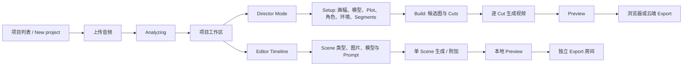

# 4i Music Video 用户 Journey

## 1. 调研口径

本文按真实浏览器操作还原从上传音乐到导出 MV 的完整流程，不使用首页宣传文案补全未进入的功能。

证据强度统一为：

- **直接观察：** 已在页面中操作，并得到页面、网络任务或下载文件结果。
- **界面可见：** 控件和说明存在，但未执行会产生额外扣费、覆盖、退出或付款的最终动作。
- **推测：** 由界面行为或网络结构推导，仍需复现时验证。
- **未验证：** 本次没有进入或没有足够证据。

测试条件：使用浏览器既有登录态，上传 1 个 8 秒、689 KB 的 WAV 文件；项目画幅选择 16:9。账号标识、会话信息、任务 Token、用户 ID 和媒体签名参数均未写入文档。

## 2. 主流程总览

Director 是向导式生成路径；Editor Timeline 是单页场景编辑路径。两条路径共享同一个项目、音频转写和图片资产库，但使用不同的场景数据组织方式。

## 3. Journey A：项目与音频上传

### A1. 进入 Music Video

1. 从左侧导航进入「Create Music Video」。
2. 已有项目以卡片展示模式、标题、状态和更新时间；已导出的项目显示「Exported」，并提供「Download」和「Delete」。
3. 点击「New project」进入上传态。

直接观察证据：[项目列表](evidence/01-project-list-exported.png)、[上传页](evidence/02-new-project-upload.png)。

### A2. 上传音乐

上传页提供两种输入：

- 本地拖放或「Upload audio」选文件；HTML 文件输入接受 `audio/*`、`.mp3`、`.wav`、`.flac`，单文件选择。
- 在「or paste URL…」输入框粘贴音频 URL。

本次实际选择 WAV 文件。页面没有显示最大音频大小，文件输入也没有可见上限；因此只能确认 689 KB 文件成功，不能推断更大文件的限制。URL 导入只确认入口存在，未提交外部 URL。

### A3. 上传后分析

1. 选中文件后，页面立即显示「Analyzing…」。
2. 该状态没有百分比、分阶段说明或取消按钮。
3. 约 20 秒后自动创建项目，项目名取文件名 `audio`，并进入工作区。
4. 工作区显示音频波形、播放控制、`0:08`、「Transcribe」和「Replace audio」。

直接观察证据：[分析中](evidence/03-audio-analyzing.png)、[项目工作区](evidence/04-workspace-choice.png)。

### A4. 实际可见的音乐分析结果

上传完成后，产品没有展示 BPM、音乐 Beat、Mood、Energy、歌曲段落标签或独立 Lyrics 分析面板。可见结果为音频时长、波形，以及按需触发的语音转写。

点击「Transcribe」后，本次得到：

- 时长：`0:08`；
- 词数：`15 words`；
- 全文：`The following is a clear transcription of spoken dialogue, despite the background music. Transcript end.`；
- 下载的 TXT 包含单词级时间戳；
- 可另行下载 SRT 和 ASS。

「Edit」会把全文拆成逐词输入项，每个词可单独删除；「Done editing」结束编辑。页面中的「15-second beats」出现在后续故事分段步骤，语义是故事节拍，不是音乐 Beat Marker。

直接观察证据：[转写弹窗](evidence/09-transcript-modal.png)、[逐词编辑](evidence/10-transcript-edit.png)、[TXT](evidence/downloads/audio.txt)、[SRT](evidence/downloads/audio.srt)、[ASS](evidence/downloads/audio.ass)。

### A5. 选择工作模式

工作区给出两个并列入口：

- 「Director Mode」：向导式完成 Setup、Build、Export；
- 「Editor Timeline」：在单页中配置每个 Scene。

页面同时估算 `0:08 audio · ~1 segments`。以下先记录 Director 主流程，再记录 Editor Timeline 分支。

## 4. Journey B：Director Mode

### B1. Setup 第 1 步：Aspect ratio

进入 Director 后为全屏式工作区，顶部持续显示音频波形、播放时间、预计积分和 Setup / Build / Export 三阶段导航。

画幅可选：`1:1`、`16:9`、`9:16`、`4:3`、`3:4`。本次选择 `16:9`。

证据：[Aspect ratio](evidence/05-director-aspect-ratio.png)。

### B2. Setup 第 2 步：生成档位

页面提供：

- Express：约 10 秒生成一个 Cut，`0.005 credits/s`，页面标注较低保真度；
- Standard：约 40 秒生成一个 Cut，`0.02 credits/s`，页面标注 hero-grade；
- 图片网格单独计费。本次初始总预估为 `0.19 credits`。

后续可对每个 Cut 单独选择 Express 或 Standard，不要求整个项目固定为同一档。

证据：[生成档位](evidence/06-director-speed.png)。

### B3. Setup 第 3 步：Plot

Plot 是可编辑文本框。点击「Generate with AI」后，系统先确保转写存在，再根据音频与转写生成故事方向并回填。生成内容仍可手工修改。

本次生成的是从昏暗录音室中的孤立状态，过渡到城市人群中的情绪释放。该文本随后成为角色、环境与 Segment 规划的上下文。

证据：[生成前 Plot](evidence/07-director-plot.png)、[生成后 Plot](evidence/08-director-plot-generated.png)。

### B4. Setup 第 4 步：Characters

1. 页面初始有「Main character」卡片。
2. 名称、描述均可编辑；可添加空白角色或移除角色。
3. 角色图片区域提供 Prompt、模型和「Create image」入口。
4. 点击「Make it for me」且已有角色时，先出现「Regenerate characters?」确认框，明确说明现有角色会被移除。
5. 本次取消了覆盖确认，因此自动重建角色的最终输出未验证。

证据：[Characters 页面](evidence/11-director-characters.png)、[真实操作日志](evidence/interaction-observations.md)、[脱敏结构](evidence/project-schema-sanitized.json)。

### B5. Setup 第 5 步：Environments

点击「Make it for me」后进入「Generating environments…」。本次自动生成 2 个环境及图片：

1. `Dimly Lit Studio`：昏暗、孤立的录音空间；
2. `Vibrant Urban Crowds`：带闪烁灯光和同步舞者的城市街道。

两张图均为 1024×1024。环境卡可编辑名称和描述，并提供「Regenerate」「Remove」「Pick image」「Maximize」。本次任务完成后页面余额随生成结果下降。

证据：[生成前](evidence/interaction-observations.md)、[生成后](evidence/interaction-observations.md)、[环境卡](evidence/interaction-observations.md)、[图片放大](evidence/14-image-lightbox.png)。

「Pick image」打开 Chapter Images 弹窗：

- Library：当前项目图片和其他项目图片；
- Generate：选择参考图、填写编辑描述、选择 Standard / Premium 并生成；
- Add：上传 PNG / JPG / WebP，页面标明最大 12 MB，也支持粘贴或图片 URL。

本次完成了 Library 选图、页签和模型控件检查；没有从 Add 提交外部文件，也没有在 Generate 页额外付费生成。

证据：[Library](evidence/15b-image-picker-clear.png)、[Add](evidence/16-image-picker-add.png)、[Generate](evidence/17-image-picker-generate.png)、[Premium](evidence/17b-image-picker-premium.png)。

### B6. Setup 第 6 步：Segments / Storyboard

1. 点击「Create segments with AI」。
2. 页面显示「Generating…」「Please wait, creating segments…」。
3. 8 秒音频生成 1 个 Segment，标题为 `Studio Isolation`，覆盖 `0:00–0:08`。
4. Segment 有可编辑的标题、摘要和 6 条 Cut 描述。
5. 可新增空白 Cut 描述，也可删除单条描述。

生成的 6 条描述依次覆盖：人物对麦克风低语、灯光可视化音乐、空录音室慢移、走出录音室、城市人群同步舞动、人物情绪释然。此处得到的是镜头计划，不等于已生成 6 个视频 Cut。

证据：[生成中](evidence/18-segments-generating.png)、[生成结果](evidence/19-segments-generated.png)、[Segment 编辑](evidence/19b-segment-editor.png)。

## 5. Journey C：Build、单 Cut 编辑与生成

### C1. 生成候选图

进入 Build 后，左侧是 Segment，右侧有 Cuts / Videos 页签；初始为 `0 cuts`。

1. 点击「Generate 4 images」。
2. 弹出「Who and where is in this scene?」，允许复核本 Segment 使用的 Cast 与 Environment。
3. 点击「Looks good — generate 4 images」后异步生成。
4. 约 20 秒后得到 4 张候选图，并自动选为 4 个 Cut。

这里存在明确的两层数据：Setup 规划了 6 条 Cut 描述，但本次 Build 只生成 4 张图并组成 4 个实际 Cut；实际 Cut 使用了前 4 条描述。

证据：[Build 空态](evidence/20a-build-overview.png)、[复核弹窗](evidence/21-image-generation-review.png)、[生成过程日志](evidence/interaction-observations.md)、[生成结果](evidence/23-cuts-generated.png)。

### C2. 单个 Cut 可修改内容

每个已选 Cut 可以：

- 编辑镜头描述 / Prompt；
- 「Return to candidates」退回候选区；
- 「Remove image」或「Pick image」替换画面；
- 「Maximize」查看大图；
- 用 `− / +` 按 1 秒调整时长；
- 开关 Lipsync；
- 查看分配到该时间段的 Transcript；
- 「Move left / Move right」调整顺序；
- 在仍有未分配时长时添加 Cut。

本次 4 个 Cut 初始各 2 秒。退回一个 Cut 后，剩余 3 个 Cut 自动重分配为 `2 / 2 / 4` 秒并继续覆盖 8 秒；重新选择候选图时，该图追加到末尾，系统再次重分配时长。随后手工恢复为每个 2 秒。

证据：[Cut 卡片](evidence/23c-cut-cards.png)、[退回候选](evidence/24-candidate-returned.png)。

### C3. 单 Cut 视频生成与重生成入口

Videos 页签按 Cut 显示一行：Chosen image、Rendered video、Prompt、Transcript、Lipsync、状态、Express / Standard 价格、「Generate」和「Edit」。

本次执行顺序：

1. 第 1 个 Cut 使用 Standard，2 秒费用显示 `0.04 credits`；状态从「Enhancing with Standard…」变为「Generated」。
2. 剩余 3 个 Cut 使用 Express 并行生成，每个 2 秒费用显示 `0.01 credits`；状态同时进入「Generating video…」，再分别成功。
3. 「Edit」在没有附加视频时打开「Attach from Generations」；本次没有匹配的 P-Video 16:9 历史素材，因此没有完成附加。
4. 已完成行仍保留模型与生成入口，可用于再次生成；本次没有对同一 Cut 发起第二次付费任务，所以旧版本保留、覆盖和再次扣费规则未验证。

证据：[待生成列表](evidence/27-videos-pending.png)、[附加入口](evidence/28-videos-onboarding-attach.png)、[Standard 生成](evidence/29-standard-info-generating.png)、[单条完成](evidence/30-one-video-generated.png)、[并行生成](evidence/32-three-videos-generating.png)、[全部完成](evidence/33-all-videos-ready.png)。

### C4. 部分成功

当只有 1/4 Cut 视频完成时，已完成视频可以播放，其他 Cut 仍为 Pending；此时 Preview 已可用。其余 3 个 Cut 可并行继续生成，不需要重新开始整个 Segment。

证据：[单条成功](evidence/30-one-video-generated.png)、[部分预览](evidence/31-partial-preview.png)、[并行生成](evidence/32-three-videos-generating.png)。

## 6. Journey D：Preview 与 Director Export

### D1. Preview

- 没有任何 Cut 视频时点击 Preview，会出现「Preview failed」，正文要求先生成或附加至少一个 Cut 视频，并提供「Retry」「Close」。关闭后还会出现「Your cuts are ready」引导，可选择继续检查 Cuts 或进入 Create videos。
- 只有 1/4 视频成功时，可得到 8 秒部分预览。
- 4/4 全部成功时，可得到完整 8 秒 Blob 预览，支持播放、音量、进度和全屏；页面提供「Rebuild preview」和「Go Export」。

证据：[无视频失败](evidence/interaction-observations.md)、[下一步引导](evidence/26-next-step-create-videos.png)、[单条成功](evidence/30-one-video-generated.png)、[部分预览](evidence/31-partial-preview.png)、[完整预览](evidence/34-complete-preview.png)。

### D2. Export 页面

Export 阶段标题为「Stitch & ship」，显示：

- 1 个 Segment；
- 4 个 Cuts；
- 4 个已生成视频；
- 总时长 `0:08`；
- 每个 Segment 的完成检查；
- SRT 与 ASS 下载入口。

页面没有分辨率、帧率、码率、编码器、视频封装格式或水印开关。页面说明可在未完成全部 Cut 时提前导出，未完成段会成为黑帧；本次最终导出使用 4/4 完成状态。

证据：[Export 页面](evidence/35-export-page.png)、[Export 概览](evidence/35a-export-overview.png)。

### D3. 两种导出方式

**Cloud export：** 点击后从 3%「Encoding on server…」进入 74%「Waiting for export…」。进度弹窗可关闭，任务继续在后台运行。完成后出现「Export complete」与「Download video」。

**Export and Download：** 在浏览器中加载视觉素材并合成，显示进度和「Cancel export」。完成后进入相同的下载完成弹窗。

本次两条路径都进入完成态；保留的 Director 下载文件为 8.000 秒、H.264、1280×704、30 fps，音频为 AAC 44.1 kHz 单声道。选择的是 16:9，但实际文件为 1280×704；页面没有让用户另选导出分辨率。抽帧未观察到可见水印，但这不能证明所有账号或套餐都无水印。

证据：[云端排队](evidence/36-cloud-export-queued.png)、[云端处理中](evidence/37-cloud-export-progress.png)、[导出完成](evidence/38-export-complete.png)、[浏览器合成](evidence/40-browser-export-progress.png)、[Director MP4](evidence/downloads/audio-cloud.mp4)、[成片抽帧](evidence/39-exported-video-frame.jpg)。

## 7. Journey E：Editor Timeline 分支

### E1. Editor 页面结构

Editor 是单页编辑器，顶部有返回项目、项目名、画幅、播放按钮、全局波形、`0:00 / 0:08`、Saved 和 Delete。页面向下依次包含：

1. Setup：画幅、默认 Lipsync 模型、默认 Scene 模型；
2. Audio transcription：转写、再次转写和下载；
3. Image library：Director 生成的 6 张图片、上传和 AI 图片生成；
4. Timeline：Scene 时间块和单 Scene 编辑器。

证据：[Editor 全页](evidence/44-editor-full-page.png)、[Timeline 详情](evidence/44-editor-full-page.png)。

### E2. Timeline 的真实组织方式

8 秒音频显示 `1 scenes` 和 1 个 `8s` 时间块。单条详情为 `0:00–0:08`，包含局部播放滑杆和 Transcript。

本次没有观察到传统多轨编辑器结构：

- Audio：只有页面顶部的全局波形，没有独立命名的 Audio 轨；
- Waveform：顶部使用波形画布；
- Beat Marker：没有观察到音乐节拍标记或 Beat 轨；
- Scene / Video Clip：视频附加在 Scene 时间块上，没有单独的 Clip lane；
- Transition：没有转场轨、转场类型或转场时长控件。

证据：[Editor 全页](evidence/44-editor-full-page.png)。

### E3. 单 Scene 配置与生成

每个时间段可切换为「Lipsync」或「Scene」。可配置：Prompt、First image、Last image、图片编辑、模型档位和生成操作。Lipsync 与 Scene 有各自的 Express / Standard / Premium 模型价格。

本次按 Lipsync 路径操作：

1. 未设置首帧时点击「Generate」，原位提示必须提供 start image，没有创建任务。
2. 打开 First image 的 Chapter Images，选择一张已有图片。
3. 选择 Express；8 秒任务弹出约 `0.04 credits` 的费用确认，可勾选「Do not ask again」。
4. 确认后显示「Generating…」「starting」。
5. 任务完成后短暂出现「This segment finished, but the video was not attached here. Browse finished videos」。数秒后无需手工操作，视频自动附加。
6. 附加后显示 `Segment 8s · Video 8s`，并提供「Regenerate」「Download」「Browse」。

「Regenerate」入口真实存在，但本次未发起第二次任务，因此二次生成是否覆盖旧视频、是否保留版本仍未验证。

证据：[类型与字段](evidence/45-editor-lipsync-scene.png)、[首帧校验](evidence/interaction-observations.md)、[选首帧](evidence/47-editor-first-image-picker.png)、[费用确认](evidence/48-editor-cost-confirm.png)、[生成中](evidence/interaction-observations.md)、[完成未附加](evidence/interaction-observations.md)、[自动附加](evidence/59-editor-video-attached-valid.png)。

### E4. Timeline Preview 与 Export

点击 Preview 后先出现「Building preview…」「Stitching scene clips with audio…」和本地合成进度，随后得到 8 秒 Blob 视频。

点击 Export 会跳到独立 Export 页面：

1. 初始显示「Loading export room…」；
2. 完成后显示 Ready 100%，并提供「Save video」；
3. 摘要为 Duration `0:08`、Scenes `1`、Gaps `None`、Audio `Finalized`；
4. Timeline 列出 1 条 `lipsync`，范围 `0:00–0:08`；
5. 页面提供「Refresh」「Export again」「Save video」和「Back to project」。

本次已到达 Timeline 导出完成页并执行 Save video。下载文件为 H.264、1280×720、30 fps，音频为 AAC 48 kHz 双声道，实际时长 8.064 秒；抽帧未观察到可见水印。

但这份文件的内容不是当前 8 秒 Lipsync Row：它按约 2 秒依次出现歌手、空录音室、霓虹人群和调音台，与先前 Director 四镜头蒙太奇一致；当前 Row 的媒体在全部抽帧中均是歌手对麦克风。Editor 在生成该 Row 之前就已显示由 Director 导出留下的 `Export ready`。因此，本轮只能确认“Timeline Export 页面完成且可下载”，同时确认“它复用/重封装了既有 Director 内容”；无 Director 历史的纯 Timeline 导出未验证。

证据：[Preview 构建](evidence/52-editor-preview-building.png)、[Preview 完成](evidence/53-editor-preview-ready.png)、[Export 加载](evidence/54-timeline-export-loading.png)、[Export 完成](evidence/55-timeline-export-ready.png)、[Export 页下载](evidence/downloads/audio.mp4)、[当前 Row 视频](evidence/downloads/audio-timeline-row.mp4)、[三者抽帧对比](evidence/61-export-content-comparison.jpg)。

## 8. 外围 Journey

### 8.1 账号与积分

头像菜单显示积分余额、「Buy credits」、Profile、Settings 和 Sign out。购买说明为 `1 credit = 1 euro`，最低购买 5 credits。本次未进入付款页、未修改设置、未退出登录。

证据：[脱敏账号菜单](evidence/57-account-menu-redacted.png)。

### 8.2 全局 Create 菜单

顶部「Create」展开后包含 Music Video、Music、Video、Animated movie（Experimental）和 Story。除 Music Video 外，其余入口不属于本次复现范围，未继续进入。

证据：[Create 菜单](evidence/58-create-menu.png)。

### 8.3 删除项目

项目卡和项目内均有 Delete。点击后会要求确认；本次选择取消并保留证据项目。最终删除结果和删除后的恢复能力未验证。

## 9. 本次真实到达的终点与证据边界

- Director：完成上传、分析、转写、Plot、环境、Segment、候选图、4 个 Cut 视频、部分与完整 Preview、云端导出、浏览器导出及 MP4 下载。
- Editor Timeline：完成单 Scene Lipsync 生成、自动附加、本地 Preview，并到达 Ready 100% 的独立 Export 页；Save video 的内容实测复用了先前 Director 蒙太奇，不等于当前 Row 视频。
- 不需要人工验证码、登录或付款；使用的是既有登录态与已有积分。
- 未执行购买积分、Sign out、确认删除、角色全量覆盖重建、同一 Cut / Scene 的二次付费重生成。
- 未触发远端 AI 任务失败、积分不足、上传格式错误、超限文件、网络中断或云端导出失败，因此这些错误分支必须保留为未验证。
