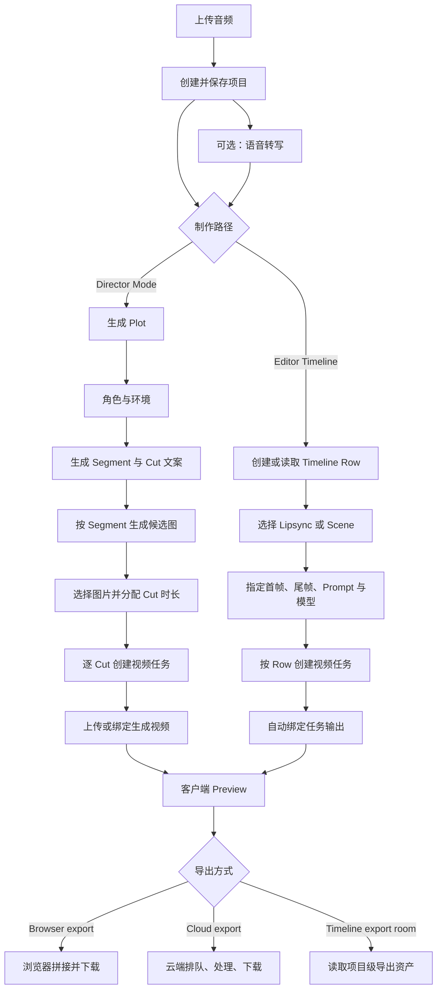

# 4i Music Video：AI 工作流

## 文档边界

本文只描述在浏览器中实际走通的生成链路，以及由页面状态和网络请求能够支持的后端推测。测试输入是一段约 8 秒的 WAV 音频。证据标记如下：

- **实测：** 页面、下载文件或网络请求中直接观察到。
- **推测：** 由多个实测信号推导，复现时需要再次验证。
- **未验证：** 本轮未获得可支持结论的证据。

产品提供两条制作路径：Director Mode 负责从歌曲概念自动拆到多镜头；Editor Timeline 负责按时间段手工指定 Lipsync 或 Scene 生成。两条路径共用项目、音频、转写、图片库、视频生成任务和导出能力。

## 端到端流程

## 1. 音频接入与初始分析

### 输入

**实测：**

- 本地上传控件接受 `audio/*,.mp3,.wav,.flac`，且只允许选取 1 个文件。
- 同页提供 URL 输入框，提示文案为 `or paste URL…`。
- 上传 8 秒 WAV 后，页面进入 `Analyzing...`，约 20 秒后自动创建项目并进入工作区。
- 工作区得到项目标题、音频时长、播放控件和波形画布。
- 相关证据：[上传页](evidence/02-new-project-upload.png)、[分析中](evidence/03-audio-analyzing.png)、[工作区入口](evidence/04-workspace-choice.png)。

### 输出

**实测：** 项目持久化结果中出现音频地址、音频时长、标题、画幅、Timeline Rows、转写、Director 数据和导出字段。前端通过 `PUT /api/music-video/projects/{projectId}` 持续保存编辑状态。

**未验证：**

- 上传页没有展示文件大小上限，本轮也未进行超限文件测试。
- 页面没有输出 BPM、音乐 Beat、Mood、Energy、调性或乐段结构。
- 波形画布证明前端会读取音频样本，但不能据此认定后端做了音乐理解。

因此，复现时应把「上传后的 Analyzing」与「音乐特征分析」分开建模；本轮唯一获得明确结构化结果的分析是语音转写。

## 2. 转写链路

**实测流程：**

1. 用户点击 `Transcribe`。
2. 前端调用 `POST /api/music-video/transcribe`。
3. 返回全文、语言、时长、单词时间戳、片段和字幕相关数据。
4. 页面显示转写弹窗，并允许逐词编辑或删除。
5. 用户可下载 TXT、SRT、ASS。

本次转写结果为 15 个词，覆盖约 8 秒音频。原始逐词结果保存在 [audio.txt](evidence/downloads/audio.txt)，页面证据见 [转写弹窗](evidence/09-transcript-modal.png) 和 [逐词编辑](evidence/10-transcript-edit.png)。

**推测：** 转写结果既用于 Timeline Row 的台词显示，也用于 Lipsync 任务的音频切片和自动 Prompt。Director 的 Plot 生成在尚无转写时可能先触发转写，因为实测点击 Plot 的 AI 生成后出现了转写结果；网络顺序支持这一点，但接口内部编排未直接可见。

## 3. Director Mode 工作流

### 3.1 Setup：画幅与生成档位

**实测：** Director Setup 依次提供 Aspect、Speed、Plot、Characters、Environments、Segments 六步。

- 画幅：`1:1`、`16:9`、`9:16`、`4:3`、`3:4`。
- Speed：Express 与 Standard。
- Express 页面标价约 `.005 cr/sec`，预估约 10 秒/镜头。
- Standard 页面标价约 `.02 cr/sec`，预估约 40 秒/镜头。
- 图片网格使用 `gpt-image-2`，当时显示约 `.15 cr`；8 秒 Express 视频预估 `.04 cr`。
- 页面明确表示后续可按 Cut 改模型。

证据：[画幅](evidence/05-director-aspect-ratio.png)、[速度与成本](evidence/06-director-speed.png)。

### 3.2 Plot：从音频语境生成故事概述

**实测：** Plot 是可编辑文本框，点击 `Generate with AI` 后调用 `POST /api/music-video/storyboard-summary`。请求以服务端事件流（SSE）方式返回内容，文本逐步填入 Plot。

本次生成结果将作品概括为：孤独人物在昏暗录音室难以表达，随后走入充满人群和灯光的城市，完成情绪释放。生成结果仍可人工改写。证据：[生成前](evidence/07-director-plot.png)、[生成后](evidence/08-director-plot-generated.png)。

**推测输入：** 转写文本、音频时长、当前项目设置。页面没有展示实际 Prompt，网络证据也不足以确认是否直接上传整段音频给大模型。

### 3.3 Characters：角色资产

**实测：**

- 每个角色包含名称、描述、角色图、来源与生成状态。
- 支持 `+ Add`、`Remove`、`Create image`、`Make it for me`。
- `Make it for me` 在已有角色时先显示覆盖确认；本轮取消，未验证角色自动生成的完整响应。
- 单张角色图生成显示 `.02 cr`。

本次项目已有 `Main character`，描述为歌曲情绪核心的风格化动画主角。证据：[角色页](evidence/11-director-characters.png)、[真实操作日志](evidence/interaction-observations.md)、[脱敏结构](evidence/project-schema-sanitized.json)。

### 3.4 Environments：场景资产与参考图

**实测：** 点击 `Make it for me` 后调用 `POST /api/music-video/storyboard-environments`，页面先进入 `Generating environments…`，随后得到 2 个环境及对应图片：昏暗录音室和充满人群的城市街道。积分从 `.50` 降至 `.46`。

环境卡支持：

- 修改名称和描述。
- `Regenerate` 重新生成图片。
- `Remove` 删除环境。
- `Pick image` 从 Library、Generate、Add 三个来源选择图片。
- `Maximize` 查看大图。
- Generate 支持参考图、多图输入、编辑描述与 Standard/Premium 模型。
- Add 支持 PNG、JPG、WebP，页面标注上限 12 MB，也支持图片 URL 和粘贴。

证据：[生成中](evidence/interaction-observations.md)、[生成结果](evidence/interaction-observations.md)、[图片选择器](evidence/15b-image-picker-clear.png)、[图片生成](evidence/17-image-picker-generate.png)。

**推测：** 环境文本先由语言模型返回，再由图片任务生成环境图。点击一次后自动得到文字与图片，但本轮没有捕获足以确认内部是单接口串行编排还是前端继续发起图片生成任务的完整请求体。

### 3.5 Segments：故事段与镜头描述

**实测：** 页面说明为 `Plan the 15-second beats`，点击 `Create segments with AI` 后调用 `POST /api/music-video/storyboard-overview`。8 秒音频生成 1 个 Segment、6 条 Cut 描述，并显示 `full audio covered`。

本次 Segment 为 `Studio Isolation`，时间范围 `0:00–0:08`，包含：录音室近景、灯光与器材、空房间慢移、走出录音室、城市群舞、人物释然表情等 6 个镜头描述。用户可以：

- 编辑 Segment 标题和摘要。
- 编辑每条 Cut 描述。
- 添加、删除 Cut。
- 查看 CAST 与 WHERE 关联项。

证据：[生成中](evidence/18-segments-generating.png)、[生成结果](evidence/19-segments-generated.png)、[Segment 编辑](evidence/19b-segment-editor.png)。

> 注意：这里的 `beats` 是故事节拍，即约 15 秒的叙事分段。页面没有展示音乐 Beat Marker，不能将其当作节拍检测结果。

### 3.6 Build / Cuts：从故事段生成候选图

**实测流程：**

1. 进入 Build 后，每个 Segment 可编辑摘要、角色、环境和可选的 Image Steer。
2. 点击 `Generate 4 images`。
3. 页面弹出 `Who and where is in this scene?`，用户复核角色与环境。
4. 确认后调用 `POST /api/music-video/generate-images`。
5. 约 20 秒后得到 4 张 16:9 候选图，积分从 `.46` 降到 `.31`。
6. 4 张图片自动成为已选择 Cut，覆盖完整 8 秒，每张初始约 2 秒。

候选图生成使用前 4 条 Cut 描述。本次生成了 4 张 760×428 PNG 候选图。证据：[生成确认](evidence/21-image-generation-review.png)、[生成过程日志](evidence/interaction-observations.md)、[候选图结果](evidence/23-cuts-generated.png)。

每个 Cut 的图片阶段支持：

- 编辑镜头 Prompt。
- `Return to candidates` 取消选择。
- `Remove image` 删除图片。
- `Pick image` 从图片库替换。
- `Maximize` 查看大图。
- 使用 `−` / `+` 以 1 秒步长调整时长。
- 开关 Lipsync。
- 查看当前 Cut 对应的转写文字。
- 左移、右移和添加 Cut。

**实测时长行为：** 退回一个 Cut 后，其余 Cut 自动重分配时长以继续覆盖 8 秒；重新加入候选图后会附加到队尾，顺序不会自动回到原位。说明 `selected`、`order` 和 `duration` 是三个独立状态。

### 3.7 Build / Videos：逐 Cut 生成视频

**实测：** Videos 标签为每个已选 Cut 建立独立生成单元。每行包含 Prompt、Lipsync、模型、状态、转写、Chosen image、Rendered video、Generate 与 Edit。

生成链路如下：

1. 用户选择 Express 或 Standard。
2. Job 输入使用与当前 Cut 时间段对应的音频地址；高可信推测由前端或服务层完成切片并取得 `audioSegmentUrl`，但本轮没有把片段上传单独归因到 `upload-audio` 路由。
3. 前端调用 `POST /api/create/jobs` 创建 P-Video 任务。
4. 通过 `GET /api/create/jobs/{jobId}` 轮询任务。
5. 成功后取得输出视频地址。
6. `POST /api/music-video/upload-segment-video` 将结果绑定或复制到项目 Cut。
7. 项目通过 `PUT /api/music-video/projects/{projectId}` 保存 `jobId`、`status`、`videoUrl` 和 `videoDuration`。

本次 4 个 Cut 中，第 1 个使用 Standard，2 秒成本 `.04 cr`；其余 3 个使用 Express，每个 2 秒成本 `.01 cr`。页面允许并行生成多个 Cut。最终 4 个任务均成功，积分从 `.31` 降至 `.24`。证据：[一个镜头成功](evidence/30-one-video-generated.png)、[其余并行生成](evidence/32-three-videos-generating.png)、[全部完成](evidence/33-all-videos-ready.png)。

任务证据显示：

- Express 模型标识为 P-Video Draft，Standard 为 P-Video。
- Provider 为 `replicate`。
- 输入包含 Prompt、图片、Cut 音频、时长、画幅和 `720p` 分辨率意图。
- 计费使用 `chargeOnSuccess` 语义，即成功后扣费。
- 任务带有项目类型和目标类型，Director Cut 的目标类型为 `discountCut`。

**未验证：** Provider 的具体第三方模型版本、重试次数、超时规则和失败退款策略没有直接证据。

## 4. Editor Timeline 工作流

### 4.1 Timeline Row

**实测：** 8 秒音频初始形成 1 个 Row，覆盖 `0:00–0:08`。页面上方显示波形；Timeline 主区显示一个 Scene 块及其详情编辑器。未观察到独立的 Audio、Beat Marker、Video Clip 或 Transition 轨道。

Row 有两种生成类型：

- **Lipsync：** 使用首帧、可选尾帧、Prompt、转写和切片音频。
- **Scene：** 使用图片、可选 Last Frame Image、Prompt 与 Scene 模型。

页面为 Lipsync 与 Scene 分别提供 Express、Standard、Premium 模型。证据：[Timeline 全页](evidence/44-editor-full-page.png)、[两种类型](evidence/45-editor-lipsync-scene.png)。

### 4.2 Lipsync 任务

**实测流程：**

1. 选择 Lipsync。
2. 未设置首帧时点击 Generate，页面内联报错：`A start image is required for lipsync.`，不会创建任务。
3. 从图片库选取 First Image。
4. 选择 Express 后弹出成本确认，本次 8 秒显示 `.04 cr`。
5. 确认后创建 P-Video Draft 任务，页面状态依次出现 `Generating…`、`starting`。
6. 任务成功后短暂显示：`This segment finished, but the video was not attached here. Browse finished videos`。
7. 数秒后无需人工操作，视频自动绑定到 Row，显示 `Segment 8s · Video 8s`，并启用 Preview 与 Export。

证据：[缺首帧校验](evidence/interaction-observations.md)、[成本确认](evidence/48-editor-cost-confirm.png)、[生成中](evidence/interaction-observations.md)、[成功但未绑定](evidence/interaction-observations.md)、[自动绑定](evidence/59-editor-video-attached-valid.png)。

任务的自动 Prompt 包含嘴型随音频变化、根据音频说话、轻微随音乐节奏动作和呼吸等指令。此 Prompt 并非用户输入原文，说明前端或后端会把 Lipsync 模板、转写片段与用户 Prompt 合并。

**推测：** `job.status = succeeded` 与项目 Row 已写入 `videoUrl` 不是同一事务，因此存在「任务已完成但项目尚未绑定」的短暂中间态。复现时应保留单独的 Attach/Recovery 步骤，并允许后台自动恢复。

### 4.3 Scene 任务边界

**实测 UI：** Scene 类型提供 Prompt、Image、Last Frame Image、Express/Standard/Premium 模型、Generate 和 Pick generations。图片与尾帧都可以通过图片选择器编辑。

**未验证：** 本轮只切换并记录了 Scene 表单，没有实际提交 Scene 视频任务。因此 Scene 是否需要音频、尾帧在 Job 请求中的字段名、模型输入合同、成本确认、生成状态及成功后的绑定流程都不能从本次证据中确定。复现时可以复用 Row 级任务框架，但不能直接照搬 Lipsync 的音频与 Prompt 模板。

## 5. Preview 与 Export

### 5.1 Preview

**实测：** Director 在无任何视频时预览会弹出错误：`No videos yet — generate or attach at least one cut video first.`，支持 Retry 与 Close。1/4 Cut 生成成功后已经可以建立 8 秒部分预览；现有证据无法确认其余 3 个未完成区段具体使用静帧、黑帧还是其他占位策略。4/4 成功后可重建完整预览。

Timeline Preview 显示 `Building preview…` 和 `Stitching scene clips with audio…`，完成后生成浏览器 Blob URL 并在弹窗播放 8 秒视频。该过程有 `Local encode` 文案，支持前端本地拼接的判断。Director 的无视频、部分成功和完整成功证据分别为：[无视频错误](evidence/interaction-observations.md)、[单条成功](evidence/30-one-video-generated.png)与[部分预览](evidence/31-partial-preview.png)、[完整预览](evidence/34-complete-preview.png)；Timeline 证据为：[构建中](evidence/52-editor-preview-building.png)、[Preview 完成](evidence/53-editor-preview-ready.png)。

### 5.2 Director 导出

**实测：**

- Browser export 在浏览器内加载素材并拼接。
- Cloud export 显示排队、进度和完成状态，可关闭进度弹窗后继续后台处理。
- 页面说明 `No re-encoding — very fast`。
- 可下载 MP4、SRT、ASS。
- 页面没有分辨率、码率、帧率、水印或容器格式选择器。

本次 Director 导出文件实测为 H.264 MP4，1280×704、30 fps，AAC 单声道 44.1 kHz，时长 8.0 秒。项目画幅设为 16:9，但文件高度为 704；结合 `No re-encoding`，说明导出可能沿用源 Cut 的实际尺寸。不能假设所有 16:9 导出都会标准化为 1280×720。证据：[导出页](evidence/35-export-page.png)、[云端进度](evidence/37-cloud-export-progress.png)、[导出完成](evidence/38-export-complete.png)、[导出帧](evidence/39-exported-video-frame.jpg)。

### 5.3 Timeline Export Room

**实测：** Timeline 的 Export 会进入独立导出页。页面经历 Loading 后达到 `Ready 100%`，提供 `Save video`、`Export again`、`Refresh`。本次 `Start export` 在加载态为禁用，没有观察到新的 Timeline 导出任务被创建。

Save video 下载文件实测为 H.264 MP4，1280×720、30 fps，AAC 双声道 48 kHz，时长 8.064 秒。但内容对比显示，它复用/重封装了之前的 Director 四镜头蒙太奇，不是当前 Timeline Row。当前 Row 自身的媒体是 1280×704、24 fps、AAC 单声道 44.1 kHz、8.0 秒，全程为歌手对麦克风。

Editor 在创建 Timeline Row 之前已显示 Director 遗留的 `Export ready`，项目又只观察到单个项目级 `exportUrl`。**高可信推测：** Export Room 先读取了既有导出资产，而没有根据当前 Timeline Row 失效并重建。无 Director 历史的纯 Timeline 项目的真实导出合同仍未验证。证据：[对比图](evidence/61-export-content-comparison.jpg)、[详细元数据](evidence/export-metadata.md)。

## 6. 前后端职责划分

| 能力 | 前端可观察职责 | 后端可观察职责 | 证据级别 |
|---|---|---|---|
| 音频上传 | 文件选择、进度/Analyzing、波形显示 | 保存音频并建立项目媒体地址 | 实测 |
| 转写 | 触发、展示、逐词编辑、字幕下载 | 返回全文、词时间戳、片段 | 实测 |
| Plot | 编辑与流式渲染 | 根据项目上下文生成故事概述 | 实测 |
| 环境 | 表单、资产选择、图片库 | 生成环境描述；图片生成的内部编排未完全确认 | 实测 + 推测 |
| Segment | 显示并编辑时间段与 Cut 文案 | 生成故事段、摘要和镜头描述 | 实测 |
| 候选图 | 角色/环境复核、候选选择、排序、时长调整 | 根据 Segment 上下文生成候选图 | 实测 |
| 视频任务 | 成本确认、并发触发、轮询、绑定状态展示 | 调用视频 Provider、存储输出、成功计费 | 实测 |
| Preview | 获取素材、拼接音视频、生成 Blob | 提供各镜头媒体文件 | 实测；拼接位置为高可信推测 |
| Cloud export | 触发、轮询进度、下载 | 异步拼接完整视频 | 实测 |
| Timeline export | 进入导出房间、刷新、保存 | 本次只确认服务端/项目提供已就绪媒体；未确认新任务创建 | UI/下载实测；当前 Row 内容未进入下载文件 |

## 7. 复现时必须保留的工作流语义

1. **项目是持续保存的聚合体。** Setup、资产、Segment、Cut、任务和 UI 折叠状态都回写同一项目。
2. **AI 结果可编辑。** Plot、角色、环境、Segment、Cut Prompt 都不是只读输出。
3. **资产与时间编排分离。** Cut 图片可退回候选区；`selected`、`order`、`duration` 分别管理。
4. **视频按最小单元生成。** Director 按 Cut，Timeline 按 Row 创建独立任务，可以混用模型并并发执行。
5. **任务成功与资产绑定分离。** 必须处理输出已生成但尚未写入项目的恢复状态。
6. **允许部分成功。** Director 至少 1 个 Cut 成功后即可 Preview；尚未生成的部分不能阻断整个项目。
7. **生成前校验与成本确认。** 缺首帧时不建任务；付费生成前显示预估成本。
8. **预览与导出不是同一产物。** Preview 是临时 Blob；Director Cloud Export 产生可持久下载的 MP4。Timeline Export 本次则读到既有可下载资产。
9. **导出资产需有内容版本或模式归属。** 原产品项目中只观察到单一 `exportUrl`，导致本次 Timeline Ready 与当前 Row 不一致；严格复现应把这一缓存/归属行为作为显式状态记录。
10. **下载封装参数受页面路径影响。** Director 保留文件和 Timeline Export 页下载的尺寸、声道和采样率不同，但后者不能视为当前 Row 的正确成片合同。
11. **故事 Beat 不等于音乐 Beat。** 本轮没有可复现的 BPM 或 Beat Marker 数据源。

## 8. 未验证项

- BPM、音乐 Beat、Mood、Energy、调性、和弦、乐段等音乐分析是否存在于隐藏接口。
- URL 音频上传的抓取、校验和失败规则。
- 角色 `Make it for me` 的完整输入输出。
- Premium 视频模型的任务参数与实际输出。
- 远程视频任务失败、超时、取消、退款和服务端重试策略。
- Cloud export 与 Timeline export 的实际接口路径和请求体。
- 无既有 Director 导出时，Timeline Export 的新任务创建、缓存失效和正确 Row 成片参数。
- Transition 数据和转场渲染逻辑；页面中未观察到对应轨道或编辑器。
- 水印策略；本次样本帧未见可见水印，但页面没有水印开关，也未覆盖不同账户或付费档位。
