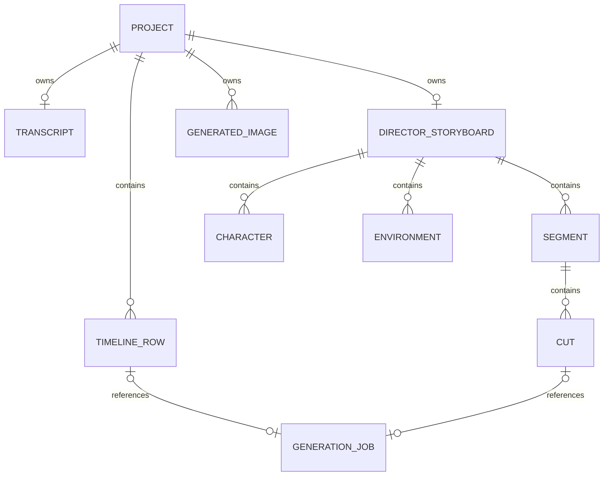

# 4i Music Video：核心数据结构

## 建模说明

以下结构来自项目读取响应、项目自动保存请求、视频任务响应和页面交互的交叉还原。它不是产品公开类型定义。

- **观察字段：** 在浏览器网络响应或项目状态中直接出现。
- **推测字段：** 为解释页面行为而补出的约束或枚举，以注释标明。
- **代码块默认规则：** 未带「推测」注释的字段名均为观察字段；`Inferred*` 类型、建议接口和带「推测」注释的值不属于原始合同。`?` 只表示本次快照中允许缺省，不代表已验证服务端必填规则。
- 示例使用占位 ID 和占位媒体地址；鉴权、账户归属、内部数据库修订信息及任何可复用凭据均已省略。
- 字段可能随着 `contentVersion` 演进，复现时建议在持久层保留版本迁移。

## 聚合关系



项目是唯一聚合根。Timeline 与 Director 不是两个项目，而是同一项目下的两套编排数据。图片库为两条路径共用；转写也可同时服务 Timeline 台词、Lipsync 和字幕导出。

## 1. Project

```ts
type AspectRatio = "1:1" | "16:9" | "9:16" | "4:3" | "3:4";

interface MusicVideoProject {
  id: string;                         // 观察：项目 ID
  title: string;                      // 观察：默认取上传文件名
  audioUrl: string;                   // 观察：持久媒体地址
  audioDuration: number;              // 观察：秒
  referenceImageUrl?: string;
  previewImageUrl?: string;
  aspectRatio: AspectRatio;

  pVideoModelId?: string;             // 观察：默认视频模型
  defaultIllustrativeModelId?: string;

  rows: TimelineRow[];
  transcript?: Transcript;
  generatedImages: string[];         // 观察：项目内是媒体 URL 字符串数组

  storyboard?: LegacyStoryboard;      // 观察：本次为空，含义未验证
  discountStoryboard?: DirectorState;
  uiState: ProjectUiState;

  exportUrl?: string;
  exportNeedsAudioMux?: boolean;
  exportError?: string;
  pendingExportJobId?: string | null;
  cloudExportStartedAt?: string;
  durationReductionPreference?: string | null;

  contentVersion?: number | string;
  createdAt?: string;
  updatedAt?: string;
}

interface ProjectUiState {
  workspaceMode?: "director" | "editor";
  configCollapsed?: boolean;
  editorSetupCollapsed?: boolean;
  storyboardCollapsed?: boolean;
  skipGenerateCostConfirm?: boolean;
}

interface LegacyStoryboard {
  // 本次响应只确认该容器存在，内部合同未验证。
  [key: string]: unknown;
}
```

`exportUrl` 是项目根级单值；本轮没有观察到 `exportMode`、`sourceRowsVersion`、内容 Hash 或 Director / Timeline 分开的导出地址。这与本次 Timeline Export 页下载旧 Director 内容的行为一致，但“单字段必然是根因”仍属推测。

### 持久化语义

**实测：** 页面修改后会调用 `PUT /api/music-video/projects/{projectId}`。保存对象不只包含业务内容，也包含工作区选择、折叠状态和跳过成本确认等 UI 状态。

**推测：** 项目更新采用文档式覆盖或大粒度 Patch，而非每个实体独立 CRUD。复现时可使用聚合版本号或 ETag 处理并发覆盖；本轮只能确认服务端响应含内部修订元数据，不能确认其冲突策略。

## 2. Transcript

```ts
interface Transcript {
  text: string;
  language?: string;
  duration: number;
  words: TranscriptWord[];
  segments: TranscriptSegment[];
  lyricSubtitles?: unknown[];         // 观察到容器；本次为空，元素结构未验证
}

interface TranscriptWord {
  word: string;
  start: number;                      // 秒
  end: number;                        // 秒
}

interface TranscriptSegment {
  id?: string | number;
  start: number;
  end: number;
  text: string;
}
```

**观察约束：**

- 转写全文、词时间戳和音频时长都保存在项目内。
- Timeline Row 根据自己的 `start` 与 `duration` 显示对应台词。
- SRT 以连续语句为主；ASS 在 Cut 边界拆分显示区间。
- 逐词编辑会改变项目中的转写内容，页面支持删除单词。

**未验证：** 本次逐词元素没有 `confidence`；`lyricSubtitles` 为空数组，其元素结构、生成算法及与普通转写 Segment 的优先级均未验证。

## 3. TimelineRow

```ts
type TimelineKind = "lipsync" | "scene";

type ObservedRowStatus = "succeeded";
type InferredRowStatus =
  | "idle"
  | "starting"
  | "processing"
  | "failed";

interface TimelineRow {
  id: string;
  start: number;
  duration: number;
  kind?: TimelineKind;
  modelId?: string;
  prompt: string;

  imageInputs: {
    image?: string;
    last_frame_image?: string;
  };
  firstImage?: string;
  lastImage?: string;

  audioSegmentUrl?: string;
  jobId?: string;
  status?: ObservedRowStatus | InferredRowStatus;
  videoUrl?: string;
  videoDuration?: number;

  generating?: boolean;
  error?: string;
}
```

### 关键观察

1. 本次 8 秒项目有 1 个 Row：`start = 0`、`duration = 8`。
2. Lipsync 首图被写入 `firstImage`，而同一时刻 `imageInputs.image` 仍可能为空；这两个字段不能简单视为同一字段。
3. 任务成功时保存 `jobId`、`status = succeeded`、`videoUrl` 和 `videoDuration = 8`。
4. 页面短暂出现「任务完成但视频未绑定」，说明任务状态和 Row 媒体写入可以非原子完成。

### 建议的复现不变量

- `start >= 0`，`duration > 0`。
- 同一轨道的 Row 应连续覆盖或明确允许空洞；原产品本次只展示连续覆盖。
- Lipsync 生成前必须存在 `firstImage` 或等价首帧输入。
- `videoDuration` 与 `duration` 不一致时，Preview/Export 需要裁剪、补帧或报错；具体策略未验证。
- `generating` 是 UI 运行态，不应替代持久任务状态。

## 4. 图片库与项目图片引用

```ts
type ProjectGeneratedImageRef = string; // 观察：媒体 URL

interface ImageLibraryResponse {
  history: unknown[];                 // 观察到字段；本次为空
  projectGroups: ImageProjectGroup[];
}

interface ImageProjectGroup {
  id: string;
  title: string;
  count: number;
  isImageLibrary: boolean;
  updatedAt: string;
}
```

**实测：** 项目读回中的 `generatedImages` 是图片 URL 字符串数组，不是带 `prompt/modelId` 的对象数组。独立图库接口返回 `history` 和 `projectGroups`；本次的 Group 只观察到 `id/title/count/isImageLibrary/updatedAt`，不在没有证据时补写单张资产对象合同。

产品 UI 可同时选择环境图、Cut 候选图、上传图片和其他生成图片。Library、Generate、Add 三个入口的结果最终都以 URL 引用写入角色、环境、Cut 或 Timeline Row。

**推测：** 媒体本身应有项目之外的存储/归属记录，但其内部资产字段本次未捕获。

## 5. DirectorState

```ts
type DirectorPhase = 0 | 1 | 2;       // 观察映射：Setup / Build / Export
type DirectorSpeed = "express" | "standard";

interface DirectorState {
  started: boolean;
  activeStep: number;                 // Setup 内部步骤，本次最终为 5
  completedSteps: number[];
  modelMode: DirectorSpeed;

  summary: string;                    // Plot
  storyInput?: string;

  characters: Character[];
  environments: Environment[];
  segments: DirectorSegment[];

  navPhase: DirectorPhase;
  navSetupStep: number;
  navBuildTab?: "cuts" | "videos";
}

interface Character {
  id: string;
  name: string;
  role?: string;
  description: string;
  imageUrl?: string;
  source?: string;
  stylized3d?: boolean;
  busy?: boolean;
}

interface Environment {
  id: string;
  name: string;
  description: string;
  imageUrl?: string;
  busy?: boolean;
}
```

`busy` 是卡片级异步状态。角色和环境可以先只有文本，再绑定图片；因此图片不能作为实体存在的必填条件。

## 6. DirectorSegment 与 Cut

```ts
interface DirectorSegment {
  id: string;
  title: string;
  start: number;
  duration: number;
  summary: string;
  detail?: string;

  characterIds: string[];
  environmentIds: string[];
  cutDescriptions: string[];

  gridImageUrl?: string;
  gridImageError?: string;
  imageSteer?: string;
  lipsync?: boolean;
  busy?: boolean;

  cuts: DirectorCut[];
  expanded?: boolean;

  previewBusy?: boolean;
  previewProgress?: number;
  previewUrl?: string;
  previewError?: string;

  castEnvReviewed?: boolean;
}

type ObservedCutStatus = "pending" | "succeeded";
type InferredCutStatus =
  | "starting"
  | "processing"
  | "failed";

interface DirectorCut {
  id: string;
  index: number;                      // 候选生成时的原始位置
  imageUrl?: string;

  selected: boolean;
  order?: number;                     // 选中后的播放顺序
  duration: number;
  prompt: string;
  lipsync: boolean;

  audioSegmentUrl?: string;
  jobId?: string;
  status?: ObservedCutStatus | InferredCutStatus;
  videoUrl?: string;
  videoDuration?: number;
  generatedForStart?: number;
  generatedForEnd?: number;

  error?: string;
  busy?: boolean;
  loadingLabel?: string;
  previewUrl?: string;
}
```

项目快照还包含 Segment 级导出标记，但本轮没有完整保留这些字段名及语义，因此不在观察接口中伪造字段；复现可先使用第 8 节的独立 Export 状态模型。

### 时间与排序语义

**实测：**

- `cutDescriptions` 是 AI 生成的镜头计划，`cuts` 是真正可选、可排期、可生成的资产实例；两者不是同一个数组。
- 候选图片被退回后，其他已选 Cut 会重新分配 `duration` 以覆盖 Segment。
- 重新选回候选图片时会追加到已选列表末尾。
- 4 个 Cut 可以分别使用不同视频模型并并发生成。

**建议的计算字段：**

```ts
function selectedCuts(segment: DirectorSegment): DirectorCut[] {
  return segment.cuts
    .filter((cut) => cut.selected)
    .sort((a, b) => (a.order ?? 0) - (b.order ?? 0));
}

function coveredDuration(segment: DirectorSegment): number {
  return selectedCuts(segment).reduce((sum, cut) => sum + cut.duration, 0);
}
```

复现时应校验 `coveredDuration(segment) === segment.duration`，但要允许用户编辑过程中的短暂不一致。

## 7. GenerationJob

```ts
type ObservedJobStatus = "succeeded";
type InferredJobStatus =
  | "pending"
  | "starting"
  | "processing"
  | "failed"
  | "cancelled";

interface VideoGenerationJob {
  id: string;
  modelId: string;
  provider: "replicate" | string;
  status: ObservedJobStatus | InferredJobStatus;

  input: {
    prompt: string;
    image: string;
    audio?: string;                   // Lipsync/本次 Director 任务观察到；Scene 未验证
    last_frame_image?: string;        // 推测：UI/Row 有尾帧，Job 字段名未验证
    duration: number;
    aspectRatio: AspectRatio;
    resolution: "720p" | string;
  };

  output?: string;
  storedOutput?: string;
  videoDuration?: number;

  creditCost?: number;
  chargeOnSuccess?: boolean;
  creditsRemaining?: number;

  projectType?: "musicVideo" | string;
  targetType?: "discountCut" | "timelineRow" | string;
  targetId?: string;

  error?: string;
  createdAt?: string;
  updatedAt?: string;
}
```

### 脱敏示例

```json
{
  "id": "<job-id>",
  "modelId": "<p-video-model>",
  "provider": "replicate",
  "status": "succeeded",
  "input": {
    "prompt": "<user prompt plus lipsync instructions>",
    "image": "<image-media-url>",
    "audio": "<audio-segment-url>",
    "duration": 8,
    "aspectRatio": "16:9",
    "resolution": "720p"
  },
  "output": "<generated-video-url>",
  "storedOutput": "<persisted-video-url>",
  "creditCost": 0.04,
  "chargeOnSuccess": true,
  "projectType": "musicVideo",
  "targetType": "timelineRow"
}
```

**实测：** Director Standard 2 秒任务成本 `.04 cr`；Director Express 2 秒任务成本 `.01 cr`；Timeline Express 8 秒任务成本 `.04 cr`。页面显示的账户积分与任务响应内 `creditsRemaining` 曾短暂不一致，说明余额 UI 可能存在缓存或延迟，任务响应更接近计费事实。

## 8. Preview 与 Export 状态

```ts
// 以下三个状态对象是根据页面转移归纳的复现建议，不是原始 API 嵌套对象。
interface InferredLocalPreviewState {
  status: "idle" | "building" | "ready" | "failed";
  progress?: number;
  blobUrl?: string;                   // 仅当前浏览器会话有效
  error?: string;
}

interface InferredCloudExportState {
  status:
    | "idle"
    | "queued"
    | "processing"
    | "succeeded"
    | "failed";                      // failed 为合同推测，未触发
  progress?: number;
  exportUrl?: string;
  error?: string;
  startedAt?: string;
}

interface InferredTimelineExportRoomState {
  status: "loading" | "ready" | "failed"; // failed 未触发
  progress: number;
  videoUrl?: string;
}
```

**观察：**

- Preview URL 是 `blob:`，只适合临时播放，不应写入项目作为长期资产。
- Director Cloud export 的 UI 状态经过 Queuing、百分比处理和 Complete。
- Timeline Export Room 最终显示 `Ready 100%`，提供 Save video、Export again、Refresh。
- Timeline Export 页下载文件与 Director 保留文件使用不同封装参数，但画面顺序一致；它与当前 Timeline Row 的媒体内容不同。
- 因此 `ready` 只表示导出资产可用，不能在没有源版本/源模式字段时推导其与当前 `rows[]` 一致。

## 9. 数据生命周期

| 阶段 | 新增或更新的数据 | 持久性 |
|---|---|---|
| 上传音频 | `audioUrl`、`audioDuration`、`title` | 项目持久化 |
| 转写 | `transcript` | 项目持久化 |
| Director Setup | `aspectRatio`、`modelMode`、`summary`、角色、环境 | 项目持久化 |
| Segment 生成 | `segments[]`、`cutDescriptions[]` | 项目持久化 |
| 候选图生成 | `generatedImages[]`、`cuts[].imageUrl` | 资产 + 项目引用 |
| 视频任务创建 | Job 记录、`jobId`、运行态 | Job 持久化；项目运行态持续回写 |
| 视频完成 | `videoUrl`、`videoDuration`、`status` | Job + 项目引用 |
| Preview | Blob URL、局部进度 | 浏览器会话；不应长期保存 |
| Export | `exportUrl`、错误、开始时间、任务引用 | 项目持久化；本次缺少模式/内容版本，Timeline 读到了旧 Director 内容 |

## 10. 尚未确认的数据结构

- BPM、Beat Marker、Mood、Energy 等音乐分析实体，本轮项目响应和页面均未观察到。
- Transition 实体及转场参数，Timeline 中未出现。
- 字幕样式的持久化结构；本轮仅观察到 SRT/ASS 下载结果。
- 导出分辨率、码率、水印等用户可配置结构；页面没有对应控件。
- 多 Segment 项目跨段 Preview 和导出的边界处理。
- 生成任务失败详情、重试计数、取消标记和退款记录。
- Export 的源模式、源数据版本、内容 Hash 和缓存失效结构；当前项目根只观察到单一 `exportUrl`。
- Legacy `storyboard` 容器的用途及与 `discountStoryboard` 的迁移关系。
