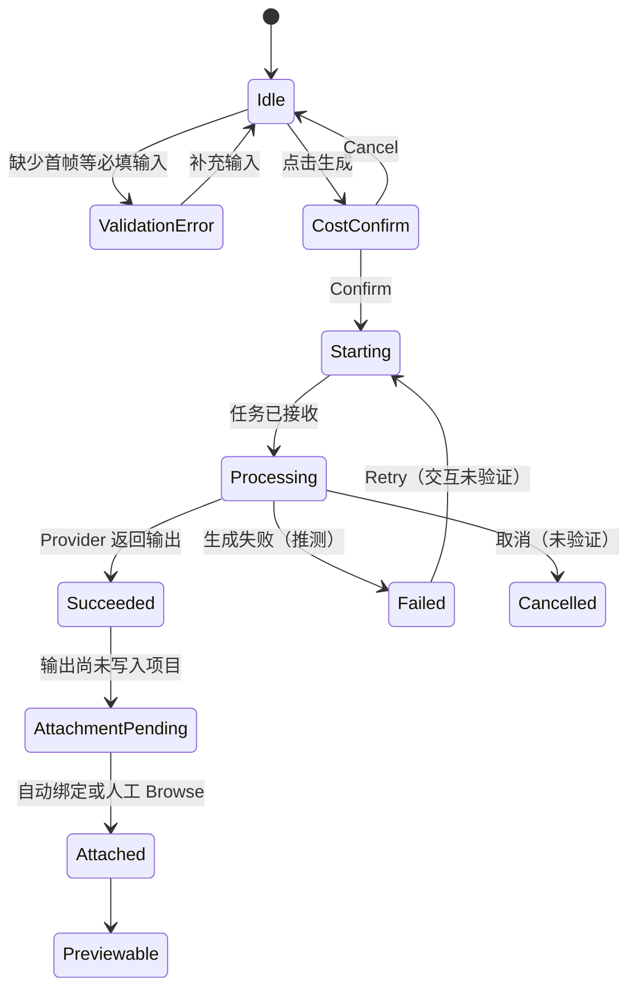
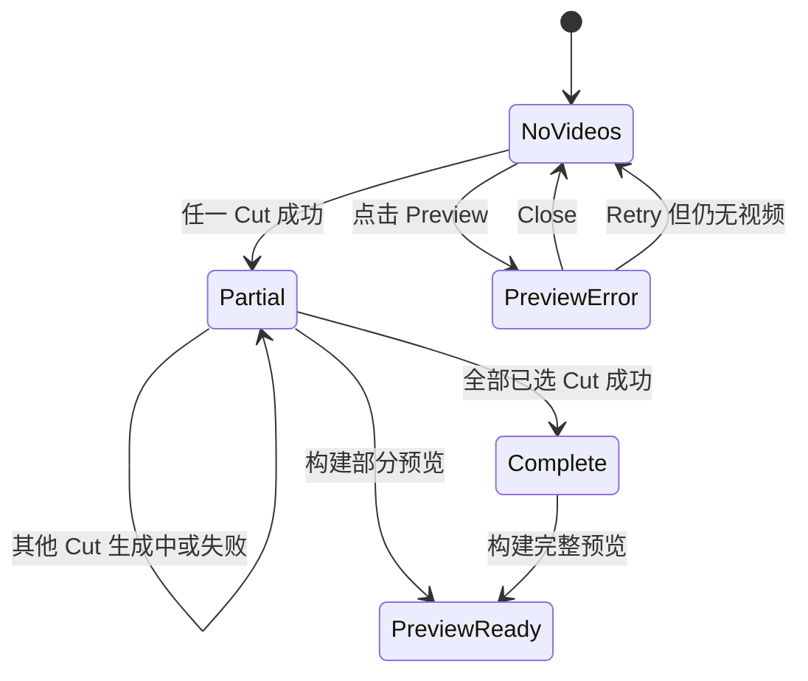
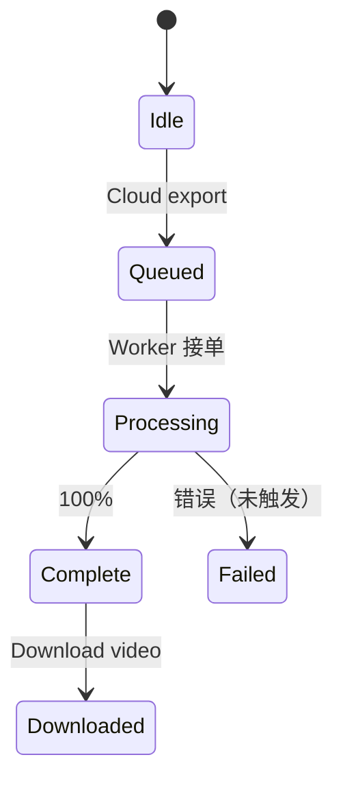
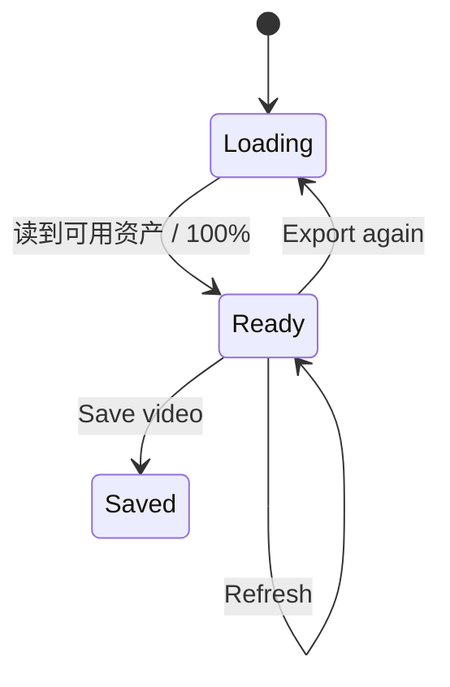

# 4i Music Video：API 与任务状态推测

## 证据与脱敏规则

本页依据浏览器网络请求、项目读取结果、任务轮询结果和页面状态编写。

- **已实测：** 请求路径和方法在真实流程中出现，且页面得到对应结果。
- **高可信推测：** 输入输出形状由项目状态变化和任务响应推导，未保存完整原始请求体。
- **未验证：** 页面行为存在，但本轮没有保留到请求路径或服务端合同。
- 所有示例只使用占位值；不记录会话信息、账户标识、内部数据库标识、可复用凭据或真实媒体链接。

## 1. 已观察 API 清单

| Method | Path | Evidence | Status | 置信度 |
|---|---|---|---|---|
| `GET` | `/api/create/models` | 进入页面后返回图片、Lipsync、Scene 与 P-Video 模型，页面据此显示档位和价格 | 成功返回；具体 HTTP 码未留存 | 已实测 |
| `GET` | `/api/music-video/projects` | 项目列表显示标题、模式、导出状态与时间 | 成功返回 | 已实测 |
| `GET` | `/api/music-video/projects/{projectId}` | 读取完整项目、Rows、转写、Director 和导出状态 | 成功返回 | 已实测 |
| `GET` | `/api/music-video/projects/published-status` | 项目列表加载时出现 | 成功返回；响应语义未展开 | 已实测路径，输出未验证 |
| `PUT` | `/api/music-video/projects/{projectId}` | 修改 Setup、资产、Cut、Row 和任务绑定后持续自动保存 | 页面显示 `Saved` | 已实测 |
| `GET` | `/api/music-video/generated-images` | 图片选择器加载 Library | 成功返回 `history` 与 `projectGroups`；Group 含标题、数量和更新时间 | 已实测 |
| `POST` | `/api/create/upload-audio` | 上传原始音频 | 返回可供后续分析与任务使用的媒体地址 | 已实测；Cut/Row 片段是否也走该路由仅为推测 |
| `POST` | `/api/create/upload-image` | 上传图片到 Library 或生成输入 | 返回可选择的图片资产 | 已实测 |
| `POST` | `/api/music-video/transcribe` | 点击 Transcribe；项目出现全文和逐词时间戳 | 成功生成转写 | 已实测 |
| `POST` | `/api/music-video/storyboard-summary` | 点击 Plot 的 `Generate with AI` | SSE 流式返回 Plot | 已实测 |
| `POST` | `/api/music-video/storyboard-environments` | 点击环境 `Make it for me` | 页面生成环境名称、描述和图片 | 已实测；内部图片编排未验证 |
| `POST` | `/api/music-video/storyboard-overview` | 点击 `Create segments with AI` | 返回 Segment 和 Cut 描述 | 已实测 |
| `POST` | `/api/music-video/generate-images` | Build 中确认角色/环境后生成 4 张候选图 | 成功返回图片候选 | 已实测 |
| `POST` | `/api/create/jobs` | Director Cut 与 Timeline Row 创建 P-Video 任务 | 任务创建成功；初始响应体未单独留存 | 已实测调用，初始输出未完整验证 |
| `GET` | `/api/create/jobs/{jobId}` | 生成中重复请求，直至任务成功 | 观察到最终 `succeeded` | 已实测 |
| `POST` | `/api/music-video/upload-segment-video` | 任务成功后，输出视频进入项目 Cut | 视频被绑定并可预览 | 已实测 |

### 未捕获到路径的真实能力

以下交互已经走通，但本轮没有保留到可靠的接口路径，因此不能编造 endpoint：

- Director Cloud export：观察到 Queuing、百分比 Processing、Complete 和持久下载。
- Timeline Export Room：观察到 Loading、`Ready 100%`、Save video、Export again、Refresh；Save video 实际下载的内容是既有 Director 蒙太奇，不是当前 Timeline Row。
- Browser export：观察到浏览器本地加载、拼接和下载；可能不需要单一导出 API。
- SRT/ASS 下载：可能由前端根据项目转写即时生成，也可能来自接口，本轮无法区分。

## 2. 项目 I/O

### 2.1 读取项目

```http
GET /api/music-video/projects/<project-id>
```

**观察响应形状：**

```json
{
  "id": "<project-id>",
  "title": "audio",
  "audioUrl": "<audio-media-url>",
  "audioDuration": 8,
  "aspectRatio": "16:9",
  "rows": ["<timeline-row>"],
  "transcript": "<transcript-object>",
  "generatedImages": ["<image-media-url>"],
  "discountStoryboard": "<director-state>",
  "uiState": "<ui-state>",
  "exportUrl": "<export-media-url-or-empty>"
}
```

**注意：** 示例只表示字段类别，不表示真实响应会把子对象序列化为字符串。

### 2.2 保存项目

```http
PUT /api/music-video/projects/<project-id>
Content-Type: application/json
```

**高可信请求形状：**

```json
{
  "title": "audio",
  "aspectRatio": "16:9",
  "rows": [
    {
      "id": "<row-id>",
      "start": 0,
      "duration": 8,
      "kind": "lipsync",
      "status": "succeeded",
      "videoUrl": "<persisted-video-url>"
    }
  ],
  "discountStoryboard": "<director-state>",
  "uiState": {
    "workspaceMode": "editor"
  }
}
```

**推测：** 更新请求是项目文档的大粒度保存。依据是 UI 状态和深层 Cut/Row 数据都回到同一项目响应中；未观察到角色、环境、Segment 或 Cut 的独立 CRUD endpoint。

### 2.3 自动保存策略

**实测：** 页面顶部在编辑后显示保存状态，网络中可见连续 `PUT`。生成任务进度、成功输出和导航位置也会触发保存。

**推测实现：**

```text
用户编辑
  → 更新前端项目 Store
  → debounce 后 PUT 项目
  → Saved

异步任务状态变化
  → 合并到 Store
  → PUT 项目
  → 刷新任务或资产视图
```

未验证 debounce 时长、冲突合并方式和离线恢复。

## 3. 音频与转写 I/O

### 3.1 上传音频

```http
POST /api/create/upload-audio
Content-Type: multipart/form-data
```

**高可信输入：** 单个音频文件；生成 Cut/Row 视频时也可能上传已切片音频。

**高可信输出：**

```json
{
  "url": "<audio-media-url>"
}
```

媒体 URL 是高可信输出；`audioDuration = 8` 最终出现在项目中，但本轮不能确定该时长是上传接口返回，还是前端/后续媒体探测得到。原始上传是否直接创建 Music Video 项目，还是前端收到媒体结果后再通过项目 API 创建，也没有完整请求序列证据。

### 3.2 转写

```http
POST /api/music-video/transcribe
Content-Type: application/json
```

**高可信请求：** 项目 ID 或音频地址，可能附语言选项。

**观察输出：**

```json
{
  "text": "<full transcript>",
  "language": "<detected-language>",
  "duration": 8,
  "words": [
    {
      "word": "<word>",
      "start": 1.12,
      "end": 1.48
    }
  ],
  "segments": ["<transcript-segment>"],
  "lyricSubtitles": []
}
```

**未验证：** 语言参数、置信度阈值、纯音乐检测和歌词/对白模式切换。本次 `lyricSubtitles` 为空，不推测其元素结构。

## 4. Storyboard AI I/O

### 4.1 Plot 流式生成

```http
POST /api/music-video/storyboard-summary
Accept: text/event-stream
```

**实测结果：** 前端持续接收文本并更新 Plot。

**推测请求：**

```json
{
  "projectId": "<project-id>",
  "transcript": "<transcript-text>",
  "audioDuration": 8,
  "storyInput": "<optional-user-direction>"
}
```

**推测响应事件：** 文本增量、完成事件、错误事件。事件名和精确 envelope 未捕获。

### 4.2 环境生成

```http
POST /api/music-video/storyboard-environments
Content-Type: application/json
```

**高可信输入：** Plot、现有角色、项目画幅和可能的视觉风格。

**观察输出语义：** 环境名称、环境描述及最终图片资产。本次得到 2 个环境。

**接口边界不确定：** 页面一次操作同时得到文本和图片。可能是该 endpoint 负责整个编排，也可能先返回环境文本，再由前端发起图片任务；不得在复现合同中未经验证地锁定一种方式。

### 4.3 Segment 与 Cut 计划

```http
POST /api/music-video/storyboard-overview
Content-Type: application/json
```

**高可信请求：**

```json
{
  "projectId": "<project-id>",
  "summary": "<plot>",
  "audioDuration": 8,
  "characters": ["<character-reference>"],
  "environments": ["<environment-reference>"]
}
```

**观察响应语义：**

```json
{
  "segments": [
    {
      "id": "<segment-id>",
      "title": "Studio Isolation",
      "start": 0,
      "duration": 8,
      "summary": "<segment-summary>",
      "characterIds": ["<character-id>"],
      "environmentIds": ["<environment-id>"],
      "cutDescriptions": [
        "<cut-description-1>",
        "<cut-description-2>"
      ]
    }
  ]
}
```

本次 1 个 Segment 返回 6 条 Cut 描述。页面文案中的 15-second beats 指叙事分段，并非音乐 Beat API。

### 4.4 候选图生成

```http
POST /api/music-video/generate-images
Content-Type: application/json
```

**高可信请求：** Segment 摘要、Cut 描述、角色与环境图片、Image Steer、画幅、数量和图片模型。

**观察输出语义：** 4 张候选图及其 URL，随后写入项目 `cuts[]` 与图片库。本次页面显示图片网格成本 `.15 cr`。

## 5. 视频任务 I/O

### 5.1 创建任务

```http
POST /api/create/jobs
Content-Type: application/json
```

**脱敏重建请求：** 下例覆盖本轮实际执行的 Director/Lipsync 输入；Scene 没有提交任务。

```json
{
  "modelId": "<p-video-model>",
  "input": {
    "prompt": "<merged-prompt>",
    "image": "<image-media-url>",
    "audio": "<audio-segment-url>",
    "duration": 2,
    "aspectRatio": "16:9",
    "resolution": "720p"
  },
  "projectType": "musicVideo",
  "targetType": "discountCut",
  "targetId": "<cut-id>"
}
```

本次实测的 Timeline Lipsync 使用相同 endpoint，但 `targetType` 为 `timelineRow`，`duration` 对应 Row 时长。

**未验证的 Scene 差异：** Scene UI 有 Last Frame Image，但本轮没有创建 Scene Job，无法确认其请求字段名、音频是否参与或是否使用另一套输入合同。

**创建响应边界：** POST 成功后前端获得可供轮询的任务引用，这是后续 GET 能成立的必要条件；本轮没有单独保存 POST 的完整响应，不能把最终 `succeeded` 记录当作创建瞬间的响应。

### 5.2 轮询任务

```http
GET /api/create/jobs/<job-id>
```

**实测：** 前端重复读取，最终得到 `status = succeeded`、输出地址和计费结果。UI 在轮询期间显示 `starting`、`Generating video…` 或 `Enhancing with Standard…`。

**轮询完成后的观察任务记录：**

```json
{
  "id": "<job-id>",
  "provider": "replicate",
  "status": "succeeded",
  "creditCost": 0.04,
  "chargeOnSuccess": true,
  "creditsRemaining": 0.19,
  "output": "<provider-output-url>",
  "storedOutput": "<persisted-output-url>"
}
```

上例数值用于表达本次 8 秒 Timeline Express 任务的实测计费，不代表固定价格。

**未验证：** 服务端实际返回过哪些中间状态字符串。页面文案可能是前端映射，不能直接当作 API 枚举。

### 5.3 绑定 Director 视频

```http
POST /api/music-video/upload-segment-video
Content-Type: application/json
```

**高可信请求：** 项目、Segment、Cut、任务输出地址和时长。

**观察结果：** 项目 Cut 得到持久 `videoUrl`，页面的 Rendered video 可播放，Preview 计数增加。

**Timeline 差异：** Timeline 任务完成后出现短暂「finished but not attached」，之后自动写入 Row。是否也调用该 endpoint，或由项目更新/API 后台回调完成，本轮未确认。

## 6. Lipsync Prompt 合成

**实测任务输入：** Timeline Lipsync 的最终 Prompt 不只是用户文本，还附加了以下语义：

- 嘴部跟随输入音频中的话语运动。
- 人物根据输入音频说话。
- 人物随音乐节奏轻微动作和呼吸。

**高可信推测：**

```text
finalPrompt = userPrompt
  + lipsyncSystemTemplate
  + transcriptSliceForRow
  + subtleMotionTemplate
```

转写片段为空或包含识别噪声时，模板仍可能被加入。复现时应保存 `userPrompt` 与最终提交 Prompt 两个值，便于重生成、审计和模型迁移。

## 7. 任务状态机

### 7.1 单个视频任务



状态证据：

| 状态 | 页面或网络证据 | 结论 |
|---|---|---|
| Idle/Pending | Director Videos 初始显示 `Pending` | 实测 UI 状态 |
| ValidationError | Timeline 缺首帧时显示内联错误且不创建任务 | 实测 |
| CostConfirm | Timeline 显示 `.04 credits` 确认弹窗 | 实测 |
| Starting/Processing | `starting`、`Generating video…`、`Enhancing with Standard…` | 实测 UI；API 枚举未确认 |
| Succeeded | Job 响应与项目状态出现 `succeeded` | 实测 API 数据 |
| AttachmentPending | `finished, but the video was not attached here` | 实测 |
| Attached | 数秒后出现 `Segment 8s · Video 8s` | 实测 |
| Failed | 本轮未触发远程生成失败 | 推测必要状态 |
| Cancelled | 本轮未观察任务取消成功 | 未验证 |

### 7.2 Director 聚合状态



**实测：** 1/4 成功已经可以 Preview，说明聚合是否可预览不能简单等于 `allSucceeded`。

### 7.3 Cloud export



**实测 UI：** Queuing 3% → Waiting/Processing 74% → Complete。弹窗可以关闭，任务继续在后台运行。

### 7.4 Timeline export room



**实测：** Save video 文件为 1280×720、30 fps、AAC 双声道 48 kHz、8.064 秒。但每 2 秒抽帧与既有 Director 四镜头顺序一致，当前 Timeline Row 则是持续的歌手 Lipsync 视频。因此 `Ready` 在本次表示“项目有可用导出资产”，不表示“该资产与当前 Row 同步”。失败与重试错误文案未触发。

`Save video` 已实际执行；`Export again` 只观察到入口，因此图中 `Ready → Loading` 是产品文案支持的高可信转移，不是本轮真正执行过的状态。加载态的 `Start export` 始终禁用，本次也没有新 Timeline Export Job 的路径证据。

## 8. Preview 与导出 I/O 推测

### Browser / Local Preview

**观察：** 页面显示 `Local encode`，结果是浏览器 `blob:` URL；Browser export 显示 Loading visual sources，且页面宣称不重新编码。

**高可信前端流程：**

```text
读取已选 Cut/Row 视频
  → 按 order/start/duration 排列
  → 对缺失 Cut 使用黑帧或占位
  → 与完整音频合成
  → 生成 Blob Preview
  → 用户触发本地下载
```

具体使用 MediaRecorder、WebCodecs、FFmpeg WASM 或其他库未验证。

### Cloud export

**观察：** 后台异步运行并将最终地址保存到项目；可以离开进度弹窗。

**推测后端合同：**

```text
CreateExport(projectSnapshot)
  → { exportReference, status: queued }

GetExport(exportReference)
  → { status, progress, outputUrl?, error? }
```

这里故意不写具体路径和字段名，因为本轮没有可靠网络证据。

### 输出差异

| 导出链 | 实测视频 | 实测音频 | 时长 |
|---|---|---|---|
| Director 保留的导出样本 | H.264，1280×704，30 fps | AAC，单声道，44.1 kHz | 8.0 秒 |
| Timeline Export 页 Save video | H.264，1280×720，30 fps | AAC，双声道，48 kHz | 8.064 秒 |
| 当前 Timeline Row 媒体 | H.264，1280×704，24 fps | AAC，单声道，44.1 kHz | 8.0 秒 |

封装参数证明页面下载文件经过与 Director 保留文件不同的处理，但画面抽帧证明其内容仍是 Director 蒙太奇。因此不能用该 1280×720 样本推导“正确 Timeline Row 导出合同”。页面没有让用户选择这些参数。内容对比证据见 [`61-export-content-comparison.jpg`](evidence/61-export-content-comparison.jpg)。

## 9. 错误、重试与幂等要求

### 已观察错误

- 无视频时 Preview 返回业务错误，支持 Retry/Close。
- Lipsync 缺首帧时前端校验，未创建计费任务。
- 任务成功但 Row 未绑定时，页面提供 `Browse finished videos`，随后自动恢复。

### 复现所需的后端语义

以下为实现建议，不是原产品已确认合同：

1. `POST /api/create/jobs` 接受客户端幂等键，防止重复确认或网络重试造成重复扣费。
2. 计费在任务成功后原子结算，与 `chargeOnSuccess` 一致。
3. Provider 成功与项目绑定分开重试；绑定失败不能丢失 Provider 输出。
4. 项目保存使用版本检查，避免任务回调覆盖用户刚修改的 Cut 顺序或 Prompt。
5. Preview/Export 聚合按 Cut 独立容错，保存每个缺失或失败的原因。
6. 导出任务支持关闭页面后继续，并通过项目状态或导出引用恢复轮询。
7. 导出资产应关联源模式、源数据版本或内容 Hash；否则会复现本次 Timeline Room 把旧 Director `exportUrl` 当作 Ready 产物的行为。这是复现建议，不是已观察的原 API 字段。

## 10. 尚待抓包验证

- 项目创建接口、音频上传后 `Analyzing...` 的精确调用顺序。
- 上传限制、URL 抓取、媒体探测和错误响应格式。
- Plot SSE 的事件名和结束标志。
- 图片生成所用的底层通用 Job API 与 `storyboard-environments` 的编排边界。
- 角色自动生成 endpoint 与响应。
- 视频 Job 的中间状态原始枚举、失败体、取消和服务端重试。
- Timeline 自动绑定视频的实际请求路径。
- Cloud export、Timeline Export Room、字幕下载的 endpoint。
- Refresh 与 Export again 是否复用同一导出记录，以及无 Director 历史时如何创建并绑定真正的 Timeline 成片。
- 水印、分辨率、码率、转场和音乐 Beat 的隐藏参数；本轮页面与已观察项目数据均无直接证据。
