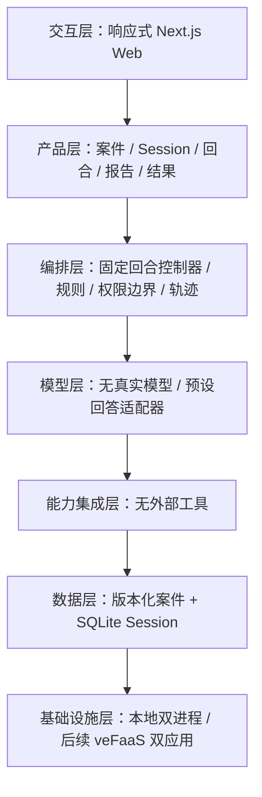

# AI 审讯室确定性 Demo 设计

本规格以 `DESIGN_SPEC.md`、`docs/技术适配声明.md`、两份阶段开发文档和已批准 PRD 为权威来源。

## 架构

主数据流：玩家通过 Web 提交结构化回合 → FastAPI 校验 → 规则引擎计算命中与状态 → 回答适配器选择合法模板 → Session 事务写入 SQLite → 前端渲染状态；报告只按结构化 ID 评分。

## Harness 五要素

| 要素 | 实现 |
| --- | --- |
| 工具 | 创建/恢复 Session、提交回合、提交报告 |
| 知识 | CASE-001 真相、时间线、证据、谎言映射和回复模板 |
| 观察 | 回合输入、命中结果、状态变化、API 错误和测试轨迹 |
| 行动 | 嫌疑人回答、证据状态、自动笔记和结果报告 |
| 权限 | 回答层无权修改真相、状态、证据映射和评分 |

## 边界与降级

- 非法输入在 Pydantic 层拒绝；业务错误返回统一错误结构。
- 无关证据、重复问题和纯施压不会降低防线。
- 报告门槛与 8 回合上限由后端强制，不能靠前端按钮隐藏。
- 当前无模型故障；未来接入模型后可回退到当前预设回答适配器。
- 前端失败保留问题和报告草稿，不制造本地成功状态。

## 设计方案比较与选择

1. 纯 Next.js 全栈：部署简单，但与通用后端手册和“先核验后端”要求不一致。
2. FastAPI + Next.js 双应用（采用）：业务边界清楚、API 可独立验收、后续模型 Key 只进后端，部署手册已有双应用路径。
3. 纯浏览器确定性 Demo：最快，但刷新恢复、密钥边界和后续真实模型接入都会返工。

选择方案 2。它多一个本地进程，但能最大程度保留已验收业务规则，并为后续上线消除架构冲突。

## 规格自检

- 占位符：无。
- 内部一致性：前端无业务规则副本；所有结案条件与 PRD 一致。
- 范围：只含 1 个案件、1 个嫌疑人、8 回合和五个页面。
- 明确裁决：PRD 的 Next.js Route Handlers 建议被用户要求和通用手册覆盖，改用 FastAPI；真实 LLM 明确暂缓。

