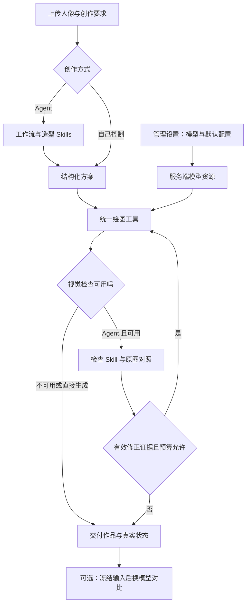

# Agent 技术选型与 Agency Agents 参考

日期：2026-09-13；2026-09-14 补充 V4 状态，未标更新的部分为当时选型依据。产品目标沿用 PRODUCT-DIRECTION-V4.md：一次配置、两种创作方式、正常任务自动交付、作品可进入模型对比。

## 本轮已落地

- 下载 msitarzewski/agency-agents 的 Prompt Engineer、Backend Architect、Reality Checker 三个角色文件及 MIT 许可证至 `docs/references/agency-agents/`，没有运行上游安装脚本，也没有更改用户级插件或 Agent 设置。来源清单记录原始 URL、获取时间及每个文件 SHA-256。GitHub commit API 被限流，未取得 commit，不能称为按 Git commit 固定；本地快照通过内容哈希校验。
- 增加 `agent-skills/creation-workflow/SKILL.md`。进入产品运行时，与现有 portrait-director 一起组成策划上下文；portrait-review 只在真实调用检查工具时加载。
- 增加 `server/agent-skills.ts`：限定可加载的项目 Skill，校验名称、语义版本和文档边界，计算文件 SHA-256。`server/agent.ts` 在实际使用时发送 `skill` 事件；每个 Skill 每轮只记录一次。现有执行记录 JSON 会包含这些事件，不包含 Skill 全文或密钥。
- 新增加载身份、非法名字/路径、角色元数据、多模态条件和实际提示装配测试。全套本地测试 35/35，通过 TypeScript 与前后端构建。

这三份运行时 Skill 是任务规则，不是三个独立模型进程；新增流程 Skill 不增加理解调用步骤。尚未测量增加指令后的 token 开销或真实供应商效果。不把本地脚本响应测试当成大模型提示词质量评测。

## Agency Agents 的实际定位

上游 README 提供专业角色文件及多种开发工具集成方式。可参考角色职责、输出契约和审查方法；它不是本产品所需的任务持久化、API 凭证存储或绘图执行引擎。

| 参考角色 | 采用的方法 | 本项目具体承载 |
| --- | --- | --- |
| Prompt Engineer | 明确输出格式、版本化指令、正常/边界/失败案例 | 现有 Zod 工具参数、Skill 加载校验、自动测试及后续模型实测 |
| Backend Architect | 根据真实规模选择架构、定义超时与失败边界 | 保留 Express 模块化单体与四种绘图 adapter；已有次数、并发和超时控制继续生效 |
| Reality Checker | 用实物证据核查完成声明 | 原图/输出检查、uncertain 状态、测试/浏览器/供应商/上线分别报告 |

未采用上游的虚构人格经历、示例成绩、等级评分、面向其他框架的固定命令或公开内部推理的提示模板。检查员不默认把证据不足判成失败，不能因怀疑就再次付费绘图。参考文档不会被 runtime loader 读取。

## MCP、Skills 和编排框架如何分工

| 组件 | 适合解决的问题 | 本项目决定 |
| --- | --- | --- |
| Skills | 如何制定犬种造型、什么时候检查、什么情况结束 | 已使用三个项目内、可追溯的运行时 Skill |
| 普通工具调用 | 查询犬种、绘图、检查等当前进程内功能 | 继续复用真实工具与 adapter，无需为每个函数增加网络层 |
| MCP | 将外部工具或跨客户端共享能力接入 Agent | 当前没有必需的外部 MCP 服务；有具体接入目标再启用官方 SDK，不能宣称已接入 |
| LangGraph.js | 长任务状态、检查点和故障恢复等编排 | 已评估，暂未安装；出现跨刷新任务恢复、异步供应商等明确需求时再决定迁移 |
| Agency Agents | 开发/审查角色的方法参考 | 已下载相关角色并形成项目采用说明；没有安装为产品执行框架 |

MCP 官方 TypeScript SDK 提供 client/server、tools/resources/prompts 及传输支持。MCP 不提供模型账号，不自动兼容所有绘图协议，也不改善图片质量。需要 MCP 时必须明确目标工具、输入输出、身份认证与调用边界；不开放任意服务器 URL 或任意本机命令供访客配置。

一个可验证的后续 MCP 场景：当另一个创作客户端也需要调用本工坊的犬种查询、受控创作和实验记录时，将现有工具通过 MCP 暴露，复用同一模型注册表、权限和绘图上限。当前只有网页客户端，先让现有 HTTP 路径完成产品任务。

LangGraph.js 提供状态化编排与持久执行能力，但仍需要选择持久存储、处理付费绘图副作用及输入保留期限。引入框架不自动保证断点恢复不重复计费；异步任务应记录供应商任务 ID，先查状态，再决定是否重试。此次没有启用外部 trace 服务或上传人像/请求日志。

## 下一版技术主线

V4 已实现服务端加密连接与默认项、本地项目历史、实际输入任务快照及选择版本继续编辑。仍使用有上限的工具循环，未实现跨刷新继续执行的后台任务队列；工作流 Skill v1.1.0 加入当前版本编辑约束。模型仍可在真实阻塞时澄清，服务端保留 ask_user。

实施优先级：先让已配置模型持续可用；再让正常 Agent 任务不需要逐步批准；最后从真实作品冻结对比输入。任务记录需要绑定原图指纹、实际完整提示词、模型与参数、Skill 版本、工具状态和耗时。默认模型先由维护者指定；自动选优需有真实评测支持。

## 可展示的技术价值与证据要求

- 多供应商图生图：验证原图确实传给 adapter，展示真实差异和失败。
- Agent 决策：展示结构化方案、工具调度、检查反馈及有预算的修正，不展示伪思考。
- Skill 可追溯：在导出记录中确认实际使用的版本和 SHA-256；不同模式的记录符合实际能力。
- 可靠性：检查失败保留图片，超时和次数上限可验证；后续恢复能力必须额外证明不会重复提交付费任务。
- 对比可解释：固定同一原图和完整提示词，记录模型差异；V4 已实现从 Agent 或手动作业冻结实际输入及完整提示词；不将一次实验当作能力排名。

## 官方来源

- [Agency Agents README](https://github.com/msitarzewski/agency-agents)
- [Prompt Engineer](https://github.com/msitarzewski/agency-agents/blob/main/engineering/engineering-prompt-engineer.md)
- [Backend Architect](https://github.com/msitarzewski/agency-agents/blob/main/engineering/engineering-backend-architect.md)
- [Reality Checker](https://github.com/msitarzewski/agency-agents/blob/main/testing/testing-reality-checker.md)
- [LangGraph.js](https://github.com/langchain-ai/langgraphjs)
- [MCP TypeScript SDK](https://github.com/modelcontextprotocol/typescript-sdk)
