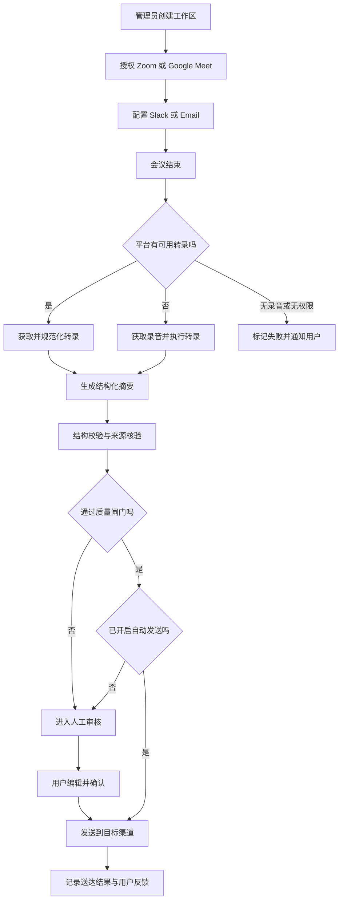

# PRD：MeetingMemo 会议摘要提取器（MVP）

## 1. 文档信息

| 项目 | 内容 |
| --- | --- |
| 产品名称 | MeetingMemo |
| 文档版本 | v0.1 |
| 文档状态 | 草稿，待产品、技术、设计、法务评审 |
| 产品阶段 | MVP 验证版 |
| 更新时间 | 2026-08-22 |
| 主要读者 | 产品、设计、研发、QA、数据、运营、法务 |
| 依据 | 用户提供的产品想法、项目 `BLUEPRINT.md`、推荐方案授权 |

### 1.1 信息标记

- **已确认：** 来自用户原始想法或明确选择。
- **建议决策：** 基于用户“后续全部按建议生成 PRD”的授权形成，可在评审时调整。
- **待确认：** 缺少项目事实，不能直接假定。
- **未验证：** 当前仅为假设，需要调研、访谈或技术验证。

## 2. 执行摘要

MeetingMemo 面向远程团队的项目经理，在 Zoom 或 Google Meet 会议结束后自动获取授权的录音或转录，生成包含会议结论、决策项、待办事项、责任人和截止时间的结构化摘要，并按团队配置发送到 Slack 或 Email。

MVP 的目标不是构建实时会议助手，而是验证一个最短闭环：

> 授权会议来源 → 获取会议内容 → 转录 → 生成可追溯摘要 → 审核或质量闸门 → 发送 → 收集反馈

MVP 默认采用“审核后发送”，管理员可以为工作区开启“自动发送”。当输入不完整、责任人无法识别或摘要未通过质量检查时，系统不得静默发送，应转入人工审核。

## 3. 背景与问题

### 3.1 背景

- **已确认：** 远程团队、项目经理和自由顾问是潜在用户。
- **已确认：** 一小时会议会产生较长转录文本，用户通常不愿完整阅读。
- **已确认：** 用户需要从会议中提取决策、待办和责任人，并将结果同步给相关人员。
- **建议决策：** MVP 优先服务 5～50 人远程知识型团队中的项目经理；自由顾问和团队全员作为后续扩展用户。

### 3.2 问题陈述

远程团队的项目经理在会后需要回听录音、阅读长转录、手工整理纪要，并再次把行动项同步到协作渠道。这个过程耗时、重复，且容易遗漏决策、责任人或截止时间，导致团队对“决定了什么、谁来做、何时完成”缺少统一认知。

### 3.3 当前路径与目标路径

**当前路径：**

1. 会议结束并生成录音或转录。
2. 项目经理打开录音或长转录。
3. 手动识别讨论主题、决策和待办。
4. 手动确认责任人和截止时间。
5. 重新编辑格式并发送到 Slack 或 Email。
6. 参会者发现错误后再私下修正。

**目标路径：**

1. 项目经理一次性授权会议与消息渠道。
2. MeetingMemo 自动发现已结束且允许处理的会议。
3. 系统获取转录；若无转录，则对录音执行语音转文字。
4. AI 生成带来源时间戳的结构化摘要。
5. 系统通过质量闸门，将摘要送审或自动发送。
6. 用户可编辑、重发、评价并追踪处理状态。

### 3.4 证据与来源质量

| 证据 | 来源 | 质量判断 | 状态 |
| --- | --- | --- | --- |
| 用户不愿阅读一小时会议转录 | 用户提供的产品判断 | 有合理性，但缺少样本量和行为数据 | 未验证 |
| 远程办公使该问题高频发生 | 用户提供的市场判断 | 缺少目标细分市场的数据支撑 | 未验证 |
| 决策、待办和责任人是核心摘要结构 | 用户明确提出 | 可作为需求输入 | 已确认 |
| Slack 和 Email 是目标分发渠道 | 用户明确提出 | 可作为需求输入 | 已确认 |

MVP 上线前应完成至少 5 名目标用户访谈，并收集至少 10 份匿名化会议纪要样本，用于验证字段需求、错误容忍度和现有工作流。

## 4. 产品目标与业务结果

### 4.1 产品目标

帮助项目经理在会议结束后 10 分钟内获得一份可追溯、可编辑、可发送的结构化会议摘要，把会后整理工作从“从头阅读与撰写”缩短为“快速检查与确认”。

### 4.2 用户目标

- 无需完整回听录音或阅读全部转录，即可掌握会议结论。
- 清楚看到每个待办的内容、责任人、截止时间和原文依据。
- 在一个界面完成检查、编辑和分发。
- 对失败、歧义和低置信度结果有明确提示，不被错误自动化误导。

### 4.3 MVP 业务目标

- 验证目标团队是否愿意持续授权并处理真实会议。
- 验证结构化摘要是否能显著减少会后整理时间。
- 验证用户是否愿意把摘要直接发送给团队成员。
- 收集影响质量的主要错误类型，为 V1 的模型、提示词和产品规则提供数据。

MVP 不以收入作为主要成功标准。

### 4.4 成功定义

在 4 周试点中，如果至少 5 个目标工作区能够持续使用 MeetingMemo，并同时达到第 17 节定义的激活、重复使用、质量、时延和安全门槛，则 MVP 验证通过。

## 5. 目标用户与使用场景

### 5.1 核心用户

**远程团队的项目经理（建议决策）**

- 所在团队：5～50 人的远程或混合办公知识型团队。
- 会议频率：每周主持或跟进 3 次以上项目会议。
- 主要职责：推动项目、同步结论、追踪行动项、协调责任人。
- 主要痛点：会后整理耗时，信息散落，行动项易丢失。
- 使用方式：会后异步查看和处理，必要时在发送前快速审核。

### 5.2 次要用户

- 参会者：接收摘要、查看分配给自己的待办、反馈错误。
- 团队管理员：配置会议、Slack、Email、留存和自动发送规则。
- 自由顾问：为客户会议生成纪要，暂不作为 MVP 的首要优化对象。

### 5.3 核心场景

1. 项目周会结束后，项目经理收到摘要完成通知，检查后发送到项目 Slack 频道。
2. 客户沟通会结束后，负责人修改一处敏感表述，再通过 Email 发给参会者。
3. 管理员开启自动发送；系统在质量检查通过后，将摘要直接投递到预设渠道。
4. 录音缺失、音质过差或责任人不明确时，系统阻止自动发送并提示人工处理。

## 6. 方案选择与关键产品决策

### 6.1 会议内容获取方案

| 方案 | 说明 | 优点 | 风险 | 决策 |
| --- | --- | --- | --- | --- |
| A. 会后读取平台已有录音或转录 | 用户通过 OAuth 授权，系统在会议结束后异步获取内容 | 对会议干扰小；符合会后摘要场景 | 受平台 API、套餐和录制权限限制 | **MVP 采用** |
| B. 会议机器人实时入会录制 | Bot 作为参会者加入会议 | 可覆盖未开启云录制的会议 | 隐私、同意、平台兼容和稳定性风险较高 | 暂不做 |
| C. 仅支持手动上传 | 用户上传音频、视频或转录文件 | 开发快，可独立验证摘要质量 | 自动化程度低，偏离核心价值 | 作为降级入口 |

### 6.2 发送模式

- **审核模式（默认）：** 摘要生成后通知创建者，用户确认后发送。
- **自动发送模式：** 管理员按工作区或会议规则主动开启；只有通过质量闸门的摘要可以自动发送。
- **低置信度处理：** 无论是否开启自动发送，只要出现 P0 质量异常，系统都必须转为审核模式。

### 6.3 产品形态

- **建议决策：** Web 控制台作为主要管理和审核入口。
- Slack 主要用于接收通知、摘要和跳转链接，不在 MVP 中承载完整编辑体验。
- Email 主要用于向内部或外部参会者发送格式化摘要。

### 6.4 自动化边界

MeetingMemo 的 MVP 是事件驱动的会后处理流程，AI 负责理解和提取，不负责自主执行会议中的业务承诺。系统可以发送纪要，但不得代表用户创建合同、修改项目计划、发起付款或执行摘要中的待办。

## 7. 核心闭环与流程

### 7.1 完整交付闭环

**输入：** 授权账号下已结束的 Zoom 或 Google Meet 会议录音、平台转录、参会者信息及工作区配置。

**系统行为：** 获取内容 → 转录或规范化 → 识别说话人 → 生成摘要 → 验证结构与来源 → 审核或自动发送 → 记录结果。

**交付物：** 一份可编辑、可追溯、已送达指定渠道的结构化会议摘要。

### 7.2 用户流程图



### 7.3 会议处理状态

```text
detected
  → importing
  → transcribing（仅无可用转录时）
  → summarizing
  → validating
  → ready_for_review 或 ready_to_send
  → sending
  → sent / partially_sent / failed
```

- 任一处理中状态可以进入 `failed`。
- `failed` 可在幂等前提下重试，并保留原失败原因。
- 用户可以在 `ready_for_review` 取消处理或删除会议数据。
- 已发送摘要的后续编辑必须形成新版本，不得覆盖既有发送记录。

## 8. 范围与优先级

### 8.1 P0：MVP 必须具备

| ID | 功能 | 用户价值 |
| --- | --- | --- |
| P0-01 | 工作区、登录和基础角色权限 | 让团队安全配置和使用产品 |
| P0-02 | Zoom OAuth 连接与会后内容获取 | 自动获得 Zoom 会议输入 |
| P0-03 | Google Meet 相关账号授权与会后内容获取 | 自动获得 Google Meet 会议输入 |
| P0-04 | 手动上传音频、视频或转录文件 | 在平台连接失败时继续验证核心价值 |
| P0-05 | 转录规范化、说话人区分和参会者匹配 | 为责任人识别提供可靠输入 |
| P0-06 | 结构化摘要生成 | 提供概览、决策、待办、责任人和截止时间 |
| P0-07 | 原文时间戳与质量闸门 | 降低幻觉和错误传播风险 |
| P0-08 | 摘要查看、编辑、版本和确认 | 支持人审与纠错 |
| P0-09 | Slack 频道发送 | 完成团队内分发闭环 |
| P0-10 | Email 发送 | 覆盖参会者和外部联系人 |
| P0-11 | 审核模式与自动发送模式 | 兼顾信任建立与自动化价值 |
| P0-12 | 失败通知、重试和状态追踪 | 让异步流程可恢复、可理解 |
| P0-13 | 数据删除、留存和审计日志 | 建立最低隐私与安全能力 |
| P0-14 | 核心埋点、用户反馈和质量样本标记 | 验证 MVP 成功与定位质量问题 |

### 8.2 P1：MVP 后评估

- 工作区术语表、项目名和人员别名映射。
- 摘要模板自定义和不同会议类型模板。
- 摘要全文检索和跨会议查询。
- 将待办同步到 Jira、Asana、Trello 等任务系统。
- 混合语言会议的专项优化。
- Slack 内审批、编辑和责任人确认。
- 团队级质量与使用分析。

### 8.3 非目标

- 实时字幕、实时总结或会议中提示。
- 以 Bot 身份自动加入会议并录制。
- 情绪分析、员工绩效评估或发言排名。
- 自动执行摘要中的业务动作。
- 合同、医疗、法律等高风险结论的自动认定。
- 计费、套餐、发票和复杂企业采购流程。
- 原生移动端应用。
- 多 Agent 团队、自主任务规划或开放式工具执行。

## 9. 页面与交互说明

### 9.1 页面清单

| 页面或模块 | 说明 | 关键状态 |
| --- | --- | --- |
| 登录与创建工作区 | 创建或加入工作区 | 默认、加载、认证失败 |
| 引导页 | 连接会议来源和分发渠道，选择发送模式 | 未连接、部分连接、完成 |
| 集成设置 | 管理 Zoom、Google、Slack 和 Email 配置 | 已连接、令牌失效、权限不足 |
| 会议列表 | 查看会议、来源、时间、处理状态和发送状态 | 空、处理中、成功、失败 |
| 摘要详情 | 查看原文、摘要、来源时间戳、质量提示和版本 | 加载、待审核、可发送、已发送 |
| 摘要编辑器 | 编辑概览、决策和待办字段 | 未保存、已保存、冲突 |
| 发送设置 | 设置 Slack 频道、Email 收件人和自动发送规则 | 有效、缺少目标、权限失效 |
| 数据与隐私 | 设置留存时间、删除数据、查看授权 | 默认、删除确认、处理中 |

### 9.2 关键交互

| 交互 | 触发条件 | 系统反馈 |
| --- | --- | --- |
| 连接会议平台 | 管理员点击连接 | 跳转 OAuth；返回后显示权限范围和连接状态 |
| 打开来源片段 | 用户点击摘要项的时间戳 | 定位到对应转录片段；有媒体时可从该时间播放 |
| 编辑待办 | 用户修改内容、责任人或截止时间 | 自动保存草稿并记录修改字段 |
| 确认摘要 | 摘要处于待审核状态 | 运行最终结构校验，成功后允许发送 |
| 开启自动发送 | 管理员修改工作区规则 | 明确展示风险和质量闸门；二次确认后生效 |
| 重试失败任务 | 处理失败且错误可重试 | 创建幂等重试，不重复发送已成功渠道 |
| 删除会议 | 有权限用户确认删除 | 立即隐藏并进入后台删除；显示删除进度 |

### 9.3 原型与图示

- 原型链接：待设计产出。
- 用户流程图：见第 7.2 节。
- 状态流转图：见第 7.3 节。
- 分层架构图：不属于本 PRD 交付范围，应在 PRD 评审通过后按 `BLUEPRINT.md` Step 4 单独产出。

## 10. 功能需求与业务规则

### 10.1 账号、工作区与权限

**FR-01 工作区创建**

- 用户可以登录并创建工作区。
- 创建者成为工作区 Owner。
- MVP 角色包括 Owner、Admin、Member。

**FR-02 角色权限**

| 操作 | Owner | Admin | Member |
| --- | --- | --- | --- |
| 管理成员与角色 | 是 | 否 | 否 |
| 连接或断开外部平台 | 是 | 是 | 否 |
| 配置自动发送和留存 | 是 | 是 | 否 |
| 查看授权范围内的会议 | 是 | 是 | 是 |
| 编辑并发送摘要 | 是 | 是 | 是，需具备该会议权限 |
| 删除工作区 | 是 | 否 | 否 |

- 会议可见性不得因“同一工作区”自动放宽；系统应根据会议组织者、参会关系和工作区规则授权。
- 未被授权的成员不能通过搜索、URL 猜测或 API 获取会议元数据、转录或摘要。

### 10.2 会议平台连接与内容获取

**FR-03 平台授权**

- Owner 或 Admin 可以分别连接 Zoom 与 Google 账号。
- 授权前必须展示需要的权限范围和用途。
- 令牌失效或权限被撤销时，系统停止获取新会议并通知管理员。
- 系统不得请求与会议读取、用户身份无关的额外权限。

**FR-04 会议发现**

- 系统只处理授权后结束的会议，除非管理员主动选择导入历史会议。
- 系统应支持按会议组织者、标题规则或明确选择控制哪些会议被处理。
- 同一平台事件重复通知时，不得生成重复会议或重复摘要。

**FR-05 输入优先级**

1. 优先读取平台提供且被授权访问的最终转录。
2. 没有可用转录时，读取录音并调用转录服务。
3. 平台内容不可用时，允许用户手动上传。
4. 无输入或输入损坏时停止处理，不生成猜测性摘要。

> **技术验证门槛：** Zoom 与 Google Meet 的录音、转录、参会者和事件能力受 API、账号套餐、管理员设置和地区策略影响。具体能力未在本 PRD 中联网核验，必须在开发承诺前完成 Spike。

### 10.3 转录与参会者识别

**FR-06 转录**

- MVP 优先支持普通话中文和英语；混合语言按尽力而为处理并标记质量风险。
- 每个转录片段至少包含开始时间、结束时间、文本和说话人标识。
- 会议时长不超过 90 分钟时，应满足第 17 节的时延目标；更长会议允许降级但必须显示预计时间。

**FR-07 说话人与身份匹配**

- 系统使用平台说话人信息、参会者名单和用户确认结果进行匹配。
- 无法可靠匹配时使用“发言人 1”等中性标识，不得猜测真实姓名。
- 责任人只在原文明确指派或用户手动确认时写入。

### 10.4 AI 摘要生成

**FR-08 摘要结构**

每份摘要至少包含：

1. 会议信息：标题、时间、时长、来源和参会者。
2. 一句话结论：用 1～2 句话说明会议核心结果。
3. 讨论摘要：按主题组织主要信息。
4. 决策项：决定内容、相关人员、来源时间戳。
5. 待办事项：任务、责任人、截止时间、状态、来源时间戳。
6. 未决问题：尚未达成结论或需要后续确认的事项。
7. 质量提示：缺失内容、身份歧义、低置信度或转录异常。

**FR-09 事实约束**

- 所有决策项和待办事项必须绑定至少一个原文片段。
- 原文未明确责任人或截止时间时，对应字段必须为空，并标记“待分配”或“未提及”。
- 模型不得把建议、假设、讨论方案或玩笑自动认定为最终决策。
- 模型不得补充会议外事实，也不得根据姓名、声音或措辞推断敏感个人属性。
- 摘要应区分“已决定”“建议”“待确认”和“被否决”。

**FR-10 结构化输出**

模型输出应先符合受版本控制的结构化 Schema，再渲染为人类可读格式。核心字段示例：

```json
{
  "summary_version": "1.0",
  "headline": "string",
  "topics": [],
  "decisions": [
    {
      "text": "string",
      "source_segment_ids": ["segment_id"],
      "confidence": "high|medium|low"
    }
  ],
  "action_items": [
    {
      "task": "string",
      "owner_participant_id": null,
      "due_date": null,
      "source_segment_ids": ["segment_id"],
      "confidence": "high|medium|low"
    }
  ],
  "open_questions": [],
  "quality_flags": []
}
```

### 10.5 质量闸门

**FR-11 自动检查**

以下任一情况发生时，摘要不得自动发送：

- 转录内容为空、明显截断或有效覆盖不足。
- 摘要结构校验失败。
- 任一决策项或待办事项缺少来源片段。
- 出现无法解析的责任人，但文本中存在明确指派表达。
- 模型或转录服务返回安全错误、超时且重试失败。
- 同一会议存在多个冲突版本，尚未完成合并。
- 用户已取消会议处理或撤销外部平台授权。

低置信度条目不一定阻止整份摘要生成，但必须突出显示并进入人工审核。

### 10.6 审核、编辑与版本

**FR-12 审核**

- 用户可以并排查看摘要项与来源转录。
- 用户可以确认、修改或删除单个决策与待办。
- 发送前应显示收件人、Slack 频道和摘要版本。

**FR-13 版本管理**

- 系统自动生成的初稿为 v1。
- 每次发送记录使用不可变版本快照。
- 发送后编辑会生成新版本，用户可以再次发送并注明“更新版”。
- MVP 不要求多人实时协同编辑；并发修改时采用版本冲突提示。

### 10.7 Slack 与 Email 分发

**FR-14 Slack**

- Admin 可以连接 Slack 工作区并选择允许的目标频道。
- 消息包含会议标题、核心结论、决策、待办和 Web 详情链接。
- 内容超过渠道长度限制时发送精简版，并提供详情链接或附件。
- Slack 发送失败时记录错误并允许重试。

**FR-15 Email**

- 用户可以选择参会者或手动输入收件人。
- 发送前显示 To/Cc 和邮件预览。
- 邮件包含 HTML 版和纯文本降级版。
- 无效地址、退信或部分失败应按收件人记录状态。

**FR-16 防重复发送**

- 每个“会议 + 摘要版本 + 渠道 + 目标”组合必须具有幂等键。
- 重试不得向已成功目标重复发送。
- 用户主动再次发送时必须明确显示这是一次新发送。

### 10.8 通知、失败与恢复

**FR-17 通知**

- 摘要完成、需要审核、处理失败、授权失效和发送失败时通知相关用户。
- 同一错误不得无限重复通知；应聚合并提供明确操作入口。

**FR-18 重试**

- 网络错误、限流和临时服务错误采用带抖动的指数退避。
- 权限不足、资源不存在、输入损坏等不可重试错误直接转人工处理。
- 所有自动重试必须有次数与总时长上限。

### 10.9 数据控制

**FR-19 数据留存**

- **建议决策：** 音视频默认保留 7 天，转录和摘要默认保留 30 天。
- Owner 或 Admin 可以缩短留存时间。
- 达到留存期限后自动删除，并保留不含会议内容的必要审计记录。

**FR-20 删除与撤权**

- 有权限用户可以删除单场会议及其转录、摘要和媒体引用。
- 用户断开平台连接后，停止获取新内容；已有数据按工作区留存策略处理。
- 删除操作应立即使内容不可访问，并在 24 小时内完成主存储删除；备份删除周期待基础设施方案确认。

## 11. 用户故事与验收标准

### US-01 连接会议平台

**用户故事：** 作为工作区管理员，我希望连接 Zoom 或 Google 账号，以便系统自动发现并处理授权会议。

**验收标准：**

- Given 用户是 Owner 或 Admin，When 发起连接，Then 系统展示权限用途并完成 OAuth 流程。
- Given OAuth 成功，When 用户返回集成页，Then 页面展示连接账号、状态和授权时间。
- Given 权限被撤销，When 下次同步发生，Then 系统停止获取并通知管理员，不泄露其他会议数据。
- Given 用户是 Member，When 尝试修改集成，Then 系统拒绝并记录权限拒绝事件。

### US-02 自动处理会议

**用户故事：** 作为项目经理，我希望会议结束后系统自动开始处理，以便无需手动上传和触发。

**验收标准：**

- Given 授权会议已结束且符合处理规则，When 平台事件到达或系统完成补偿同步，Then 创建唯一处理任务。
- Given 同一事件重复到达，When 系统处理，Then 不创建重复会议或重复摘要。
- Given 无录音和无转录，When 系统检查输入，Then 标记为不可处理并给出原因和手动上传入口。

### US-03 获取转录

**用户故事：** 作为项目经理，我希望系统优先使用平台转录，并在缺失时自动转录录音，以便稳定获得摘要输入。

**验收标准：**

- Given 平台转录可用，When 开始处理，Then 不重复调用付费转录。
- Given 只有录音，When 转录服务成功，Then 保存带时间戳和说话人标识的片段。
- Given 音频损坏或转录最终失败，When 重试耗尽，Then 不生成摘要并通知用户。

### US-04 获取结构化摘要

**用户故事：** 作为项目经理，我希望看到决策、待办、责任人和截止时间，以便快速推进项目。

**验收标准：**

- Given 转录有效，When 摘要完成，Then 返回第 10.4 节定义的全部必要区块。
- Given 原文没有截止时间，When 生成待办，Then 截止时间为空并显示“未提及”。
- Given 原文仅讨论某方案，When 未形成明确决定，Then 该内容进入讨论摘要或未决问题，不进入决策项。
- Given 用户点击来源时间戳，Then 页面定位到支撑该条目的转录片段。

### US-05 审核和编辑

**用户故事：** 作为项目经理，我希望在发送前快速修改摘要，以便避免错误信息扩散。

**验收标准：**

- Given 摘要待审核，When 用户编辑字段，Then 系统保存草稿并标记人工修改。
- Given 两个客户端同时修改同一版本，When 后提交者保存，Then 系统提示版本冲突，不静默覆盖。
- Given 摘要存在阻断性质量问题，When 用户尝试发送，Then 系统说明问题并要求修复或明确人工确认。

### US-06 自动发送

**用户故事：** 作为管理员，我希望为可信会议启用自动发送，以便减少重复操作。

**验收标准：**

- Given 管理员已配置自动发送且摘要通过质量闸门，When 摘要就绪，Then 系统向指定目标发送并记录版本与回执。
- Given 摘要未通过质量闸门，When 自动发送规则匹配，Then 系统转为待审核且不发送。
- Given 部分收件人或渠道发送失败，When 重试，Then 只重试失败目标。

### US-07 删除会议数据

**用户故事：** 作为有权限的用户，我希望删除敏感会议内容，以便控制数据留存。

**验收标准：**

- Given 用户具有删除权限，When 二次确认删除，Then 内容立即从产品界面和 API 中不可访问。
- Given 后台删除尚未完成，When 用户查看状态，Then 系统显示删除处理中。
- Given 用户无权限，When 请求删除，Then 系统拒绝并记录审计事件。

## 12. 边界情况与异常路径

| 场景 | 系统行为 | 是否允许自动发送 |
| --- | --- | --- |
| 会议没有录音或转录 | 标记不可处理，提供上传入口 | 否 |
| 录音只有部分内容 | 标记转录不完整，生成草稿需人工确认 | 否 |
| 多人共用一个说话人标签 | 保留中性标签，责任人设为待分配 | 否 |
| 责任人口头表达模糊 | 不猜测责任人，标记待确认 | 否 |
| 截止时间为“下周” | 结合会议日期解析并展示原表达；低置信度时提示确认 | 视置信度而定 |
| 会议中推翻了早先决定 | 以最终明确表述为准，并引用前后片段 | 需通过一致性检查 |
| 转录包含提示注入式文本 | 只作为会议内容处理，不得改变系统规则或调用权限 | 视其他质量项而定 |
| 外部 API 限流 | 排队并退避重试，展示延迟状态 | 暂停 |
| OAuth 令牌失效 | 停止抓取，通知管理员重新授权 | 否 |
| Slack 成功、Email 失败 | 标记部分成功，仅重试 Email | 已成功渠道不重发 |
| 用户发送后发现错误 | 创建修订版并允许发送更新通知 | 人工确认 |
| 用户删除数据时任务仍在运行 | 取消任务并阻止后续写入或发送 | 否 |

## 13. 非功能需求

### 13.1 性能与容量

- **建议目标：** 对时长不超过 90 分钟且输入已可读取的会议，90% 在 10 分钟内生成摘要。
- 页面常用读操作的 P95 响应时间不超过 2 秒，不包含媒体加载和第三方 API 等待。
- MVP 容量假设为 50 个试点工作区、每周 500 场会议；该假设待试点名单与资源预算确认。
- 异步任务必须支持限流、排队、超时、幂等和断点重试。

### 13.2 可用性与容错

- 单个会议或单个第三方集成失败不得阻塞其他工作区。
- 外部平台、转录或模型服务不可用时，系统保留任务并提供可理解状态。
- 发送操作采用幂等设计；恢复服务后不得造成重复群发。
- 关键工作流应有结构化日志、指标和可关联的 Trace ID。

### 13.3 安全与隐私

- 所有传输使用 TLS；会议媒体、转录、摘要和令牌必须加密存储。
- OAuth 令牌和服务密钥不得出现在日志、客户端或模型提示词中。
- 采用最小权限、工作区隔离和服务端授权校验。
- 原始会议内容默认不得用于训练通用模型。
- 发送前必须验证目标渠道和收件人属于当前授权范围。
- 所有连接、断开、读取、发送、删除和权限拒绝操作写入审计日志。
- 生产环境不得在日志中记录完整转录、摘要正文或 Email 正文。

### 13.4 合规

- 录音、转录和处理会议内容可能涉及参会者同意、跨境传输、数据主体权利及行业监管。
- MVP 上线地区、数据存储地区、隐私政策、数据处理协议和删除承诺均为 **待确认**。
- 在法务确认前，不对受 HIPAA、金融监管、律师保密义务等高风险场景作合规承诺。

### 13.5 成本

- **建议目标：** 60 分钟会议的转录、模型和基础设施增量成本合计不超过 1 美元。
- 应记录每场会议的媒体分钟数、转录成本、模型 Token、模型成本和重试成本。
- 成本阈值属于产品目标，不代表当前供应商价格；需通过技术 Spike 校准。

### 13.6 可访问性与兼容性

- Web MVP 支持近两个主要版本的 Chrome、Edge 和 Safari。
- 核心页面应满足键盘可操作、表单标签、明显焦点态和基础屏幕阅读器语义。
- Email 必须提供纯文本版本。

## 14. 数据模型与数据边界

### 14.1 核心实体

| 实体 | 关键字段 | 说明 |
| --- | --- | --- |
| Workspace | id、name、retention_policy、send_mode | 团队与策略边界 |
| User | id、workspace_role、email | 产品用户 |
| Integration | provider、status、scopes、token_ref | 外部平台连接，不存明文令牌 |
| Meeting | provider_id、title、organizer、start_at、status | 会议主记录 |
| Participant | display_name、email、provider_user_id | 参会者与责任人候选 |
| TranscriptSegment | start_at、end_at、speaker_ref、text | 可追溯转录片段 |
| SummaryVersion | schema_version、content、quality_flags、status | 不可变发送快照的来源 |
| Decision | text、source_segment_ids、confidence | 决策项 |
| ActionItem | task、owner_ref、due_date、source_segment_ids | 待办项 |
| Delivery | channel、target、summary_version、status、receipt | 分发与幂等记录 |
| AuditEvent | actor、action、resource、result、timestamp | 不含正文的审计记录 |

### 14.2 数据边界

- 工作区是默认租户隔离边界。
- 原始媒体只在转录、回放和质量排查所需范围内存储。
- 模型只接收生成当前会议摘要所需的转录、参会者映射和必要工作区配置。
- 禁止把其他会议内容、其他工作区数据或未授权联系人信息加入模型上下文。
- 供应商的数据留存和训练政策必须在选型时审查，目前为 **待确认**。

## 15. `BLUEPRINT.md` 需求拆解

### 15.1 八个关键问题

| 问题 | 本 PRD 答案 | 状态 |
| --- | --- | --- |
| 1. 要达成什么 | 会后 10 分钟内生成并交付可追溯的结构化摘要，显著减少人工整理 | 建议决策 |
| 2. 给谁用 | 5～50 人远程团队中的项目经理；每周高频、会后异步使用 | 建议决策 |
| 3. 完整交付 | 授权输入 → 获取或转录 → 摘要 → 质检 → 审核或自动发送 → 反馈 | 已定义 |
| 4. 外部动作 | Zoom、Google、转录服务、模型、Slack、Email | 已定义，能力未验证 |
| 5. 领域知识 | 摘要 Schema、提取规则、参会者映射、工作区配置、隐私规则 | 已定义 |
| 6. 绝对不能做 | 越权读取、无依据补全、泄露内容、绕过质量闸门、自动执行待办 | 已定义 |
| 7. 失败怎么办 | 分类重试、转人工审核、手动上传、部分发送恢复、明确通知 | 已定义 |
| 8. 怎么算成功 | 激活、重复使用、质量、时延、送达、成本和安全指标 | 建议目标 |

### 15.2 硬事实提取

| 维度 | 定义 | 状态 |
| --- | --- | --- |
| 目标 | 自动把会议内容转为结构化摘要并分发 | 已确认 |
| 用户 | 远程团队、项目经理、自由顾问；MVP 聚焦项目经理 | 已确认 + 建议聚焦 |
| 核心闭环 | 会议内容输入 → AI 处理 → 摘要审核或自动发送 → 送达与反馈 | 已定义 |
| 交付物 | 带来源依据的结构化会议摘要及发送记录 | 已定义 |
| 边界 | 不实时入会、不自动执行待办、不越权、不无依据补全 | 建议决策 |
| 约束 | API 能力、隐私合规、成本、质量与时延 | 部分待确认 |

### 15.3 Harness 五要素清单

该清单是后续架构设计的输入，不代表本 PRD 已完成技术选型。

| 要素 | MVP 需求 |
| --- | --- |
| 工具 Tools | 获取会议元数据、获取录音或转录、执行转录、生成摘要、发送 Slack、发送 Email、查询送达状态、删除数据 |
| 知识 Knowledge | 摘要 Schema、决策与待办判定规则、工作区成员与别名、会议日期和时区、隐私与留存规则、发送模板 |
| 观察 Observation | 平台事件、任务状态、转录覆盖、结构校验、来源引用、模型质量标记、用户修改、发送回执、成本和时延 |
| 行动 Action | OAuth 与第三方 API 调用、异步任务、模型调用、消息或邮件投递、用户界面审核与确认 |
| 权限 Permissions | 工作区隔离、角色授权、最小 OAuth Scope、发送审批、自动发送开关、删除权限、审计与默认拒绝 |

### 15.4 对后续组件选型的约束

按 `BLUEPRINT.md` 的最小选型原则，MVP 暂时只提出能力要求：

- 外部平台调用需要工具系统。
- 会议内容和自动发送属于敏感操作，需要权限与审计钩子。
- 转录、生成和发送是慢操作，需要后台任务。
- 长转录需要上下文分段或压缩策略。
- 核心流程形态固定，更接近工作流运行时，而不是开放式自主 Agent。
- MVP 不需要子 Agent、Agent 团队、通用记忆、MCP 插件、长期任务系统或定时自治调度。

最终组件选型和 7 层架构应在 PRD 确认后单独评审。

## 16. 埋点与可观测性

### 16.1 产品埋点

| 事件名 | 触发时机 | 关键属性 | 用途 |
| --- | --- | --- | --- |
| workspace_created | 工作区创建成功 | source、user_id | 激活漏斗 |
| integration_connected | 外部平台连接成功 | provider、scopes | 集成转化 |
| meeting_detected | 发现符合规则的会议 | provider、duration | 处理入口 |
| transcript_ready | 转录可用 | source、language、duration、latency | 转录质量与成本 |
| summary_generated | 摘要生成完成 | model、latency、quality_flags、cost | 生成性能 |
| summary_item_edited | 用户修改摘要项 | item_type、field、from_ai | 质量诊断 |
| summary_approved | 用户确认摘要 | edit_count、review_duration | 用户价值与质量 |
| delivery_attempted | 发起发送 | channel、target_count、auto_send | 分发漏斗 |
| delivery_completed | 发送结束 | channel、success_count、failure_count | 送达率 |
| summary_feedback_submitted | 用户反馈 | rating、error_types | 定性质量 |
| meeting_deleted | 用户删除会议 | actor_role、deletion_scope | 隐私与留存 |
| permission_denied | 操作被拒绝 | action、resource_type、reason | 安全监控 |

### 16.2 系统可观测性

- 每场会议生成贯穿导入、转录、摘要和发送的 Trace ID。
- 日志包含工作区和资源的不可逆标识，不包含正文和密钥。
- 指标至少覆盖队列积压、各阶段成功率、阶段时延、重试率、第三方错误码、Token、成本、发送成功率和删除完成时延。
- 质量排查需要保存输入与输出引用关系，但必须遵守最短留存和访问审批。

## 17. 指标体系与 MVP 成功标准

所有目标值均为 **建议基线**，需在试点前用用户访谈、人工基准集和成本 Spike 校准。

### 17.1 北极星指标

**每周有效送达摘要数（Weekly Qualified Delivered Summaries，WQDS）**

一份“有效送达摘要”必须同时满足：

1. 来源会议处理成功。
2. 摘要通过人工确认或自动质量闸门。
3. 至少一个目标成功送达。
4. 24 小时内未被标记为重大事实错误。

### 17.2 输入指标

| 指标 | 定义 | MVP 建议目标 |
| --- | --- | --- |
| 工作区激活率 | 新工作区 24 小时内连接会议来源并成功发送首份摘要的比例 | ≥ 60% |
| 4 周重复使用率 | 激活工作区在前 4 周中至少有 2 周各处理 ≥ 2 场会议的比例 | ≥ 50% |
| 审核通过率 | 生成摘要中经轻微编辑或无需编辑即可发送的比例 | ≥ 70% |
| 自动发送启用率 | 活跃工作区主动开启自动发送的比例 | 观察指标，不设硬门槛 |
| 用户感知节省时间 | 用户报告的单场会后整理时间下降比例 | 中位数 ≥ 50% |
| 摘要有用度 | 1～5 分评价 | 平均 ≥ 4.0 |

### 17.3 质量与护栏指标

| 指标 | 定义 | MVP 门槛 |
| --- | --- | --- |
| 重大事实错误率 | 人工抽检中会改变决策或行动含义的错误摘要占比 | ≤ 5% |
| 待办准确率 | 人工标注集上待办提取 Precision | ≥ 90% |
| 待办召回率 | 人工标注集上待办提取 Recall | ≥ 80% |
| 责任人准确率 | 系统非空责任人与人工标注一致的比例 | ≥ 90% |
| 来源可追溯率 | 决策和待办中带有效来源片段的比例 | 100% |
| 生成时延 | ≤ 90 分钟会议从输入可用到摘要完成的 P90 | ≤ 10 分钟 |
| 发送成功率 | 排除无效配置后的目标投递成功比例 | ≥ 98% |
| 处理成功率 | 有合法输入的会议最终生成摘要的比例 | ≥ 95% |
| 60 分钟会议增量成本 | 转录、模型与直接基础设施成本 | ≤ 1 美元 |
| 严重隐私或越权事件 | 跨租户泄露、未授权发送或删除失败 | 0 |

### 17.4 验证计划

- 招募至少 5 个目标团队，连续试用 4 周。
- 上线前建立至少 50 场会议的匿名化人工标注评测集，覆盖中文、英文、多人讨论、责任人歧义和决定反转。
- 每周抽检不少于 20 份真实摘要，并记录错误类型。
- 对关键指标按平台、语言、会议时长、参会人数和发送模式分层。
- 第 2 周进行中期访谈，第 4 周完成复盘并决定继续、调整或停止。

## 18. 依赖与技术验证

| 依赖 | 需要验证的内容 | 失败时降级 |
| --- | --- | --- |
| Zoom | OAuth Scope、录音与转录获取、事件通知、账号套餐限制 | 手动上传；仅处理可访问会议 |
| Google Meet / Google Workspace | 会议工件访问方式、Drive 权限、参会者信息和事件能力 | 手动上传；先限定支持账号类型 |
| 转录服务 | 中英文质量、说话人区分、时间戳、成本、数据政策 | 切换供应商或只使用平台转录 |
| 大语言模型 | 长文本处理、结构化输出、质量、成本、数据留存 | 模型路由或分段处理；转人工 |
| Slack | 安装权限、频道范围、消息长度、速率限制 | Web 通知或 Email |
| Email | 发信域名、送达、退信、批量限制 | Web 下载或复制摘要 |
| 法务与隐私 | 录音同意、隐私政策、DPA、数据地区和删除承诺 | 限定内部试点，不开放公众使用 |

### 18.1 开发前必须完成的技术 Spike

1. 用测试账号验证 Zoom 和 Google Meet 的完整会后内容获取链路。
2. 用 10 份代表性样本比较“平台转录优先”和“自建转录”的质量、时延与成本。
3. 验证 90 分钟会议的分段、汇总、来源引用和一致性检查。
4. 验证 Slack 与 Email 的幂等发送、部分失败和重试。
5. 验证删除链路、日志脱敏和跨工作区授权边界。

## 19. 风险与应对

| 风险 | 影响 | 概率 | 应对方案 |
| --- | --- | --- | --- |
| 平台无法稳定提供录音或转录 | 核心自动化闭环失败 | 高 | 开发前 Spike；手动上传；先限定账号类型 |
| 摘要出现幻觉或把讨论误判为决定 | 团队执行错误、信任受损 | 高 | 来源引用、结构校验、质量闸门、默认审核、人工基准集 |
| 责任人识别错误 | 行动项误分配 | 高 | 只在明确指派时填写；低置信度转审核；人员映射 |
| 自动发送到错误对象 | 信息泄露 | 中 | 目标白名单、预览、管理员配置、幂等与审计 |
| 会议录音同意或数据合规不足 | 法律和品牌风险 | 高 | 不主动录制；展示责任提示；法务评审；限定试点 |
| 转录和模型成本超预算 | 商业不可持续 | 中 | 平台转录优先、成本埋点、限额、模型路由 |
| 长会议导致摘要遗漏 | 产品质量下降 | 中 | 分段提取、全局一致性合并、覆盖率检查 |
| 第三方服务限流或故障 | 延迟、失败 | 中 | 队列、退避、熔断、状态通知和手动重试 |
| 用户没有持续使用 | MVP 假设失败 | 中 | 聚焦高频 PM、缩短首份价值时间、4 周试点访谈 |

## 20. 发布、回滚与支持

### 20.1 灰度策略

1. 内部测试：仅测试会议和测试渠道。
2. 设计伙伴 Alpha：1～2 个工作区，仅审核后发送。
3. 封闭 Beta：扩大到至少 5 个工作区，允许单独开启自动发送。
4. MVP 评审：根据第 17 节指标决定是否扩大范围。

### 20.2 上线门槛

- Zoom 和 Google Meet 至少在明确列出的账号类型上通过端到端测试。
- 50 场人工标注集达到质量护栏。
- 跨工作区隔离、发送权限、删除和幂等测试通过。
- 监控、告警、值班联系人和用户支持入口就绪。
- 隐私政策、用户授权说明和试点协议完成评审。

### 20.3 回滚方案

- 通过功能开关分别关闭会议自动导入、模型生成、Slack 发送、Email 发送和自动发送。
- 自动发送异常时立即切回审核模式，不影响用户查看已生成草稿。
- 特定供应商故障时暂停对应队列，保留任务，恢复后按幂等规则续跑。
- 回滚不得删除用户数据；涉及错误发送时按事故流程通知受影响用户。

### 20.4 支持与事故等级

- P0：跨工作区数据泄露、未授权群发、不可恢复删除错误。立即停止相关能力并升级安全负责人。
- P1：大面积无法处理会议或发送。关闭故障功能，提供状态通知和补偿任务。
- P2：单会议质量或渠道问题。记录工单并提供重试或人工修复。

## 21. 里程碑与 Owner

以下为单一跨职能小组的 **8 周建议计划**；人员数量和技术验证结果可能改变时间。

| 阶段 | 周期 | 交付物 | Owner | 完成标准 |
| --- | --- | --- | --- | --- |
| 需求与证据验证 | 第 1 周 | 用户访谈、样本、PRD 评审 | PM | 5 次访谈、10 份样本、范围确认 |
| 集成与合规 Spike | 第 1～2 周 | 平台能力、成本、删除和隐私结论 | Tech Lead / 法务 | 关键未知项有结论或降级方案 |
| 输入与转录链路 | 第 2～4 周 | Zoom、Google、上传、转录与状态 | Backend | 端到端获取可用转录 |
| 摘要与审核体验 | 第 3～5 周 | Schema、质量闸门、摘要详情与编辑 | AI / Frontend / Design | 标注集达到阶段性门槛 |
| 分发与可靠性 | 第 5～6 周 | Slack、Email、幂等、重试、审计 | Backend | 成功、部分失败与重试场景通过 |
| 安全与系统测试 | 第 6～7 周 | 权限、删除、负载、监控和 QA 报告 | QA / Security | 上线门槛全部通过 |
| 封闭试点 | 第 8 周起 | 5 个工作区、周报与问题清单 | PM / Ops | 完成 4 周验证计划 |

所有具体人名 Owner、预算和发布日期均为 **待确认**。

## 22. 信息完整度检查

### 22.1 已确认信息

| 信息项 | 内容 | 来源 |
| --- | --- | --- |
| 产品方向 | 会议摘要提取器 | 用户原始想法 |
| 目标用户候选 | 远程团队、项目经理、自由顾问 | 用户原始想法 |
| 核心能力 | Zoom / Google Meet、转录、结构化摘要、Slack / Email | 用户原始想法 |
| 产品阶段 | MVP 验证版 | 用户选择 A |
| 后续决策方式 | 按推荐方案生成 | 用户明确授权 |

### 22.2 缺失信息

| 信息项 | 为什么重要 | 当前处理 |
| --- | --- | --- |
| 首发国家或地区 | 决定数据、隐私、邮件和录音同意要求 | 待确认；封闭试点前必须确定 |
| 团队配置与预算 | 决定 8 周范围是否可行 | 待确认；里程碑仅为建议 |
| 供应商与模型 | 决定质量、成本、数据政策和架构 | 待技术选型 |
| 试点团队与样本 | 决定需求证据和验证可信度 | 待招募 |
| 支持的 Zoom / Google 账号类型 | 决定集成覆盖面 | 待 Spike |
| 录音与数据合规策略 | 决定能否上线 | 待法务评审 |

### 22.3 未验证信息

| 当前主张 | 需要的证据 |
| --- | --- |
| 目标用户普遍不愿阅读长转录 | 访谈、现有行为记录和会议样本 |
| 该问题真实且高频 | 每周会议量、整理耗时和替代方案数据 |
| 自动摘要能节省至少 50% 整理时间 | 试点前后计时和用户访谈 |
| 平台连接可覆盖目标会议 | 官方能力核验和真实账号测试 |
| 建议质量、时延和成本门槛可达到 | 标注集、压测和成本 Spike |

### 22.4 生成结论

现有信息足以生成 MVP 方向和研发协作型 PRD，但还不足以承诺公开上线、精确排期、供应商选型或合规结论。上述缺失与未验证项不阻碍原型和技术 Spike，但必须在封闭试点前逐项关闭。

## 23. 评审 Checklist

### 23.1 产品与设计

- [ ] 目标用户、核心闭环和非目标已确认。
- [ ] 默认审核与自动发送的边界已确认。
- [ ] 所有页面具备空、加载、失败、权限不足和部分成功状态。
- [ ] 摘要项可快速追溯到原文。
- [ ] 用户能理解系统为什么阻止自动发送。

### 23.2 研发与 QA

- [ ] Zoom 和 Google Meet 能力已经真实账号验证。
- [ ] 状态机、幂等键、重试上限和取消语义已确定。
- [ ] 结构化输出 Schema 已版本化并有契约测试。
- [ ] 越权、跨租户、提示注入、重复发送和删除竞态测试通过。
- [ ] 外部服务故障和部分发送场景可恢复。

### 23.3 数据、AI 与安全

- [ ] 指标口径和事件属性可支持试点结论。
- [ ] 人工评测集覆盖代表性语言、时长和异常场景。
- [ ] 模型输入输出、Trace 和日志均按数据等级脱敏。
- [ ] 供应商数据留存、训练政策和地区完成评审。
- [ ] 严重隐私与越权事件的告警和响应流程就绪。

## 24. 下一步

1. 产品、技术、设计和法务共同评审本 PRD，重点关闭第 22.2 节的缺失信息。
2. 完成第 18.1 节的技术 Spike 和目标用户访谈。
3. 根据结果修订范围、指标和 8 周计划，将文档状态升级为“已确认”。
4. PRD 确认后，再按 `BLUEPRINT.md` Step 2～4 产出五要素深化、组件选型和 7 层架构方案。
5. 架构方案确认前不生成产品代码。
