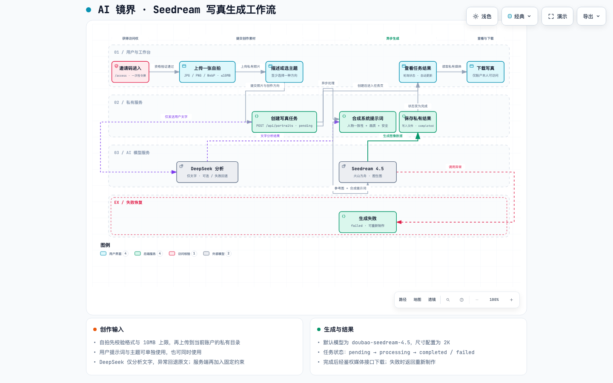

# AI 镜界

AI 镜界是一款邀请制的单图 AI 写真工具：上传一张自拍，输入画面描述或选择主题，生成并下载写真。

## Seedream 写真生成工作流

点击图片可查看原尺寸。要使用缩放、搜索和路径追踪等交互功能，请下载 [交互版 HTML](docs/visual-workflow/ai-mirror-seedream.workflow.html) 并在浏览器中打开；[工作流 JSON](docs/visual-workflow/ai-mirror-seedream.workflow.json) 是对应的 Archify 源文件。
